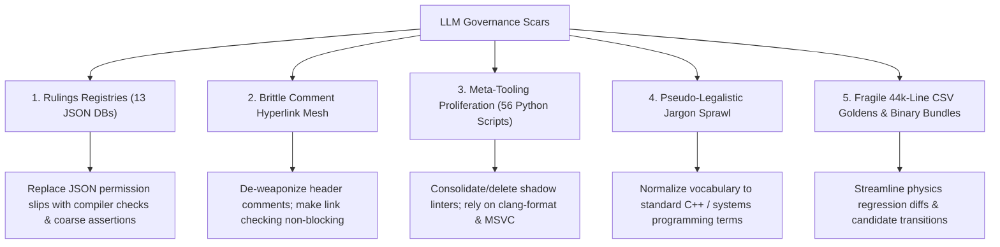

# Governance Simplification And LLM Scar Removal

Date: 2026-08-24
Status: Complete on 2026-08-28. 5/5 implementation phases and independent
terminal review passed. The exactly-once plan-completion command stopped at the
inherited DX12 terrain-baseline mismatch recorded below.
Owner: Engine owner
Priority: Selected after Recorded Interaction Playback Cursor RIC3 completion.
Commit name: `DE_BUREAUCRATIZE`

---

## Executive Summary

Earlier DB2-DB7 work already removed most governance administration. This
closure reconciles the stale plan with that landed state, removes the remaining
source-fingerprint math registry and empty diagnostics suppression file, repairs
review and validation metadata that still named deleted systems, and finishes
the single-command Physics baseline workflow without weakening byte-exact gates.

This plan details a pragmatic roadmap to dismantle these five major classes of LLM scars, replacing brittle bookkeeping with lean, maintainable engineering guardrails while preserving all core invariants: `/W4 /WX` zero-warning compilation, dependency graph direction, memory allocation constraints, and byte-exact physics determinism.

---

## The 5 Core Remediation Areas

---

## Phases & Scope

## Completion Reconciliation

| Phase | Result |
|---|---|
| 1 | Prior DB work removed aggregate, signature, complexity, reachability, and glossary registries. This closure replaces deterministic-math source fingerprints with function/domain checks and deletes the obsolete JSON. The remaining JSON files are measurable domain data or active architecture/build policy. |
| 2 | `check_related_paths.py` is advisory, its live scan is clean, and the comment guide already makes preambles optional. Existing template headers are cleaned only when their files are touched; the broader qualitative cleanup remains parked in `WNF/slop-reduction-plan.md`. |
| 3 | Prior DB work deleted the named custom formatters and meta-inventories. This closure repairs `time_validation_pipeline.py`'s four stale command paths and adds a manifest-path negative fixture. |
| 4 | The plain-language gate and fixtures are already mandatory. This closure removes the remaining required wording from SessionState and the historical ledger artifact, and aligns reviewer skills with compiler-backed source design. The broader optional terminology cleanup remains parked in `WNF/slop-reduction-plan.md`. |
| 5 | The guarded `update_baselines.py --physics` workflow already creates and stages complete transition bundles. This closure makes it the primary documented command and adds first-frame/body/field diagnostics to worker-matrix failures. |

### Phase 1: Rulings Registry Elimination & Line-Number Decoupling
**Objective:** Eliminate or consolidate the 13 JSON ruling databases in `tools/` and remove all line-number pinning from CI checks.

1. **Retire Fragile AST Inventories:**
   - Delete the aggregate permission registry (715 lines) and its inventory script. Plain structs (PODs) without internal methods should not require a JSON permission slip to exist.
   - Delete `tools/wide_signature_ownership_rulings.json` and `tools/inventory_wide_signatures.py`. High-arity functions should be addressed naturally via refactoring rather than requiring written JSON exemptions.
   - Delete `tools/function_complexity_rulings.json` (433 lines) and `tools/inventory_function_complexity.py`.
   - Audit and prune `tools/reachability_rulings.json` (761 lines); replace symbol-level reachability micro-rulings with standard linker dead-code stripping or broad configuration tests.
2. **Eliminate Line-Number Traps:**
   - Ensure no remaining checker script keys off physical line numbers. Whitespace and comment additions must never break CI.

---

### Phase 2: Comment De-Weaponization & Hyperlink Relaxation
**Objective:** Transform rigid, fragile 40-line comment headers into clean, truthful technical documentation without CI link-breakage traps.

1. **De-weaponize `tools/check_related_paths.py`:**
   - Remove `check_related_paths.py` from the mandatory preflight/fast-gate blocking path, or convert it into an advisory tool. Moving or renaming a source file should never fail CI due to dead markdown links in unrelated header comment blocks.
2. **Streamline Header Standard:**
   - Revise `Agentic/Reference/comment-style-guide.md` to remove boilerplate requirements (`File:`, `Purpose:`, `Summary:`, `Glossary:`, `Invariants:`, `Related:`).
   - Require comments only where non-obvious invariants, concurrency constraints, memory lifetimes, hardware hazards, or mathematical assumptions exist.
3. **Clean Existing Source Comments In Place:**
   - Replace ceremonial file headers with short orientation comments only where
     the file needs them. Preserve useful ownership, unit, lifetime, threading,
     sequencing, and hardware-hazard facts beside the code they explain.
   - Rewrite anthropomorphic or pseudo-legal prose in direct C++ and systems
     language. This workstream does not change algorithms, layouts, control
     flow, file paths, or public APIs.

---

### Phase 3: Meta-Tooling Prune & Python Linter Consolidation
**Objective:** Audit and eliminate redundant shadow linters in `tools/` (reducing the 56 Python scripts down to essential domain checkers).

1. **Remove Redundant Code-Formatting Scripts:**
   - Delete custom post-formatters like `tools/align_header_inline_comments.py` and `tools/separate_multiline_cpp_declarations.py`; rely solely on the pinned `.clang-format` configuration.
2. **Prune Meta-Inspectors:**
   - Delete the former incomplete-extraction inventory, which searches for remnants of previous refactors.
   - Delete `tools/inventory_glossary_terms.py` and `tools/glossary_term_rulings.json`.
   - Delete `tools/validate_governance_inventories.py` (the meta-checker that polices the other inventory tools).
3. **Preserve Essential Engine Gatekeepers:**
   - Retain and protect high-value domain validators: `tools/check_dependency_graph.py`, `tools/check_allocation_policy.py`, `tools/check_physics_regression.py`, and `tools/validate_build.bat`.

---

### Phase 4: Lexicon & Prose Normalization
**Objective:** De-obfuscate repo terminology across documentation, plan templates, and session logs.

1. **Use direct technical terms:**
   - Name plain structs, parameter objects, frame contexts, borrowed references,
     regression cases, negative tests, golden-update scripts, and file locks for
     what they are.
   - Do not invent a repository-specific synonym when ordinary C++ or systems
     terminology already describes the concept.
2. **Documentation Clean-up:**
   - Simplify `Agentic/SessionState.md` and `AGENTS.md` to focus on concrete architectural state and open issues rather than high-ceremony compliance ledgers.
3. **Identifier And Test-Title Cleanup:**
   - Rename confusing locals, parameter aliases, internal structs, and internal
     enums to concrete domain terms. Keep `m_` for members only; use names such
     as `config`, `params`, `metadata`, `report`, and `history` when those are
     the actual roles.
   - Modernize `TEST_CASE` titles so they state the behavior and failure being
     checked without campaign language. Renames must remain mechanically
     behavior-neutral and must not alter serialized names, schemas, hashes, or
     public file paths.
4. **Focused Cleanup Inventory:**
   - Review the terminology around contact-energy validation, LookLab export
     metadata, replay solver history, visual-frame hashes, baseline updates,
     file locks, state machines, collision pairs, and active-body arrays.
   - Treat ordinary engine terms such as composition root, packet, surface, and
     oracle according to their local technical meaning; replace a term only
     when it obscures the code, not merely because it appeared in an older
     audit list.

---

### Phase 5: Golden Baseline & Regression Workflow Streamlining
**Objective:** Modernize physics regression verification to reduce baseline update friction while preserving 100% byte-exact determinism.

1. **Streamline Physics Diffing & Reporting:**
   - Simplify `tools/check_physics_regression.py` output to highlight actual simulation divergences (first diverging frame, diverging body ID, metric delta) rather than raw 44,000-line diff dumps.
2. **De-bureaucratize Candidate Bundle Creation:**
   - Keep the integrity check (ensuring that intended code changes match generated test outputs), but automate and streamline the executable hashing and DLL verification into a single fast CLI command (`python tools/update_baselines.py --physics`) rather than requiring manual multi-step candidate staging.

---

## Verification & Acceptance Criteria

- [x] **Clean Build:** Solution builds with zero warnings (`/W4 /WX`) across Debug, Profile, Release, and Automation.
- [x] **Test Coverage & Determinism:** CPU tests pass and the 0/0-repeat/1/4-worker Physics matrix remains byte-exact.
- [x] **Governance Reduction:** The completed DB administration cohort removed 15 of 20 files (75%). This closure removes two more obsolete JSON permission/suppression stores while retaining domain data and active engine checks.
- [x] **Zero Line-Number Policy Traps:** Remaining policy identity uses symbols, paths, typed rules, or generated data; source lines are diagnostics only.
- [x] **Lean Fast Gate:** Deleted inventory scans remain absent; source design is compiler-backed and retained domain checks run directly.
- [x] **Focused Tool Evidence:** Determinism, native diagnostics, validation-manifest, plain-language, related-path, Physics comparator, updater, and Physics guard self-tests pass.

## Terminal Closure Evidence

- `tools\validate_build_all.bat --with-release` passed Automation, Debug,
  Profile, and Release with zero warnings and zero errors.
- `tools\validate_physics.bat` passed without changing the accepted Physics
  golden. The accepted SHA-256 remains
  `1b98431012f632d66cb18c50e3f253cea4898b57bcb8e78cdadd0de3f065e387`, and
  the 0/0-repeat/1/4-worker matrix remains byte-exact.
- `tools\validate_all_cpu_tests.bat` passed all six lanes. The Profile suite
  passed 883 test cases and 2,691,524 assertions; every coverage floor passed;
  Runtime interaction, scene parser, UI boundary, and DX12 architecture tests
  also passed.
- The dependency proof and repository scan, project-filter validation, and
  allocation-policy self-test and live scan all passed. The scene-writer
  allocation inventory now names the bounded helper that owns each unchanged
  serialization growth site after the source-design split.
- Deterministic-math, native-diagnostics, validation-manifest, plain-language,
  related-path, Physics comparator, baseline-updater, Physics-guard, and
  source-design self-tests passed. The live deterministic-math, related-path,
  plain-language, Physics-guard, and validation-manifest scans passed.
- The branch-wide compiler-backed source-design scan passes all 30 changed
  source files. DX12 transient triangles use separate direct ordinary and
  compact-ribbon operations with shared shader/submit helpers, interaction
  automation preserves one ordered traversal through narrow action/assertion
  operations, and scene saving is split into bounded simulation, presentation,
  object, and joint serialization phases. Header checks retain every distinct
  first-party consumer context, with a planted cross-project definition proving
  the scan cannot narrow back to the matching implementation alone.
- No Physics, replay, visual, causal, performance, or other golden baseline was
  changed. The historical ledger infographic was preserved byte-for-byte apart
  from its two stale review-term attributes.
- `tools\agent_validate.bat --plan-completion` ran exactly once after the
  blocker-free review. Debug, Physics, fast preflight, the six-lane CPU umbrella,
  Automation, and their subordinate checks passed; the command then stopped at
  the existing DX12 screenshot comparison for `water_ball_test` and
  `solver_smoke`. The same average differences (`4.9163` and `4.0126`) were
  already captured in run `20260827T174544Z`, before the governance DX12 source
  edit, and the earlier/current water output hashes are identical. The
  `space_three_body` image remained byte-exact. The gate was not rerun and no
  visual baseline was refreshed.
