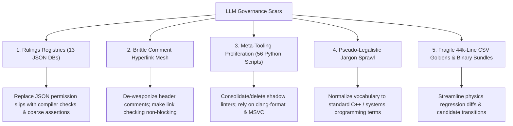

# Governance Simplification And LLM Scar Removal

Date: 2026-08-24
Status: Owner-parked 2026-08-24; 0/5 phases complete
Owner: Engine owner
Priority: Not selectable until the owner activates it in `MASTER-PLAN.md`
Commit name: `DE_BUREAUCRATIZE`

---

## Executive Summary

As autonomous LLM coding agents iterated on the repository, they accumulated extensive "meta-governance" mechanisms designed to enforce strict rigor. While well-intentioned, several of these systems crossed into bureaucratic overengineering: 13 separate JSON rulings registries (some pinning exact source line numbers), brittle comment hyperlink meshes, custom Python scripts policing other Python scripts, ceremonial pseudo-legalistic terminology, and heavy binary bundling rituals for baseline updates.

This plan details a pragmatic roadmap to dismantle these five major classes of LLM scars, replacing brittle bookkeeping with lean, maintainable engineering guardrails while preserving all core invariants: `/W4 /WX` zero-warning compilation, dependency graph direction, memory allocation constraints, and byte-exact physics determinism.

---

## The 5 Core Remediation Areas

---

## Phases & Scope

### Phase 1: Rulings Registry Elimination & Line-Number Decoupling
**Objective:** Eliminate or consolidate the 13 JSON ruling databases in `tools/` and remove all line-number pinning from CI checks.

1. **Retire Fragile AST Inventories:**
   - Delete the aggregate permission registry (715 lines) and its inventory script. Plain structs (PODs) without internal methods should not require a JSON permission slip to exist.
   - Delete `tools/wide_signature_ownership_rulings.json` and `tools/inventory_wide_signatures.py`. High-arity functions should be addressed naturally via refactoring rather than requiring written JSON exemptions.
   - Delete `tools/function_complexity_rulings.json` (433 lines) and `tools/inventory_function_complexity.py`.
   - Audit and prune `tools/reachability_rulings.json` (761 lines); replace symbol-level reachability micro-rulings with standard linker dead-code stripping or broad configuration tests.
2. **Eliminate Line-Number Traps:**
   - Ensure no remaining checker script keys off physical line numbers. Whitespace and comment additions must never break CI.

---

### Phase 2: Comment De-Weaponization & Hyperlink Relaxation
**Objective:** Transform rigid, fragile 40-line comment headers into clean, truthful technical documentation without CI link-breakage traps.

1. **De-weaponize `tools/check_related_paths.py`:**
   - Remove `check_related_paths.py` from the mandatory preflight/fast-gate blocking path, or convert it into an advisory tool. Moving or renaming a source file should never fail CI due to dead markdown links in unrelated header comment blocks.
2. **Streamline Header Standard:**
   - Revise `Agentic/Reference/comment-style-guide.md` to remove boilerplate requirements (`File:`, `Purpose:`, `Summary:`, `Glossary:`, `Invariants:`, `Related:`).
   - Require comments only where non-obvious invariants, concurrency constraints, memory lifetimes, hardware hazards, or mathematical assumptions exist.

---

### Phase 3: Meta-Tooling Prune & Python Linter Consolidation
**Objective:** Audit and eliminate redundant shadow linters in `tools/` (reducing the 56 Python scripts down to essential domain checkers).

1. **Remove Redundant Code-Formatting Scripts:**
   - Delete custom post-formatters like `tools/align_header_inline_comments.py` and `tools/separate_multiline_cpp_declarations.py`; rely solely on the pinned `.clang-format` configuration.
2. **Prune Meta-Inspectors:**
   - Delete the former incomplete-extraction inventory, which searches for remnants of previous refactors.
   - Delete `tools/inventory_glossary_terms.py` and `tools/glossary_term_rulings.json`.
   - Delete `tools/validate_governance_inventories.py` (the meta-checker that polices the other inventory tools).
3. **Preserve Essential Engine Gatekeepers:**
   - Retain and protect high-value domain validators: `tools/check_dependency_graph.py`, `tools/check_allocation_policy.py`, `tools/check_physics_regression.py`, and `tools/validate_build.bat`.

---

### Phase 4: Lexicon & Prose Normalization
**Objective:** De-obfuscate repo terminology across documentation, plan templates, and session logs.

1. **Use direct technical terms:**
   - Name plain structs, parameter objects, frame contexts, borrowed references,
     regression cases, negative tests, golden-update scripts, and file locks for
     what they are.
   - Do not invent a repository-specific synonym when ordinary C++ or systems
     terminology already describes the concept.
2. **Documentation Clean-up:**
   - Simplify `Agentic/SessionState.md` and `AGENTS.md` to focus on concrete architectural state and open issues rather than high-ceremony compliance ledgers.

---

### Phase 5: Golden Baseline & Regression Workflow Streamlining
**Objective:** Modernize physics regression verification to reduce baseline update friction while preserving 100% byte-exact determinism.

1. **Streamline Physics Diffing & Reporting:**
   - Simplify `tools/check_physics_regression.py` output to highlight actual simulation divergences (first diverging frame, diverging body ID, metric delta) rather than raw 44,000-line diff dumps.
2. **De-bureaucratize Candidate Bundle Creation:**
   - Keep the integrity check (ensuring that intended code changes match generated test outputs), but automate and streamline the executable hashing and DLL verification into a single fast CLI command (`python tools/update_baselines.py --physics`) rather than requiring manual multi-step candidate staging.

---

## Verification & Acceptance Criteria

- [ ] **Clean Build:** Solution builds with zero warnings (`/W4 /WX`) across Debug, Profile, Release, and Automation.
- [ ] **Test Coverage & Determinism:** All 750+ unit/integration tests pass; 0/1/4-worker physics determinism remains byte-exact.
- [ ] **Governance Reduction:** Total files in `tools/` reduced by $\ge 50\%$; at least 8 JSON ruling files and 15+ redundant Python scripts removed.
- [ ] **Zero Line-Number CI Traps:** Adding blank lines or comments anywhere in `SkullbonezSource/` does not trigger CI failures.
- [ ] **Fast Gate Speedup:** `tools/validate_fast.bat` execution time reduced through the elimination of AST and inventory scans.
