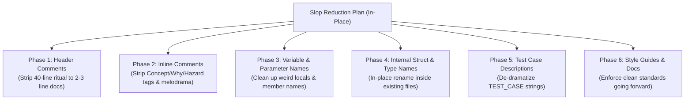

# Slop Reduction Plan: Comments, Documentation & Variable De-Obfuscation

Date: 2026-08-25  
Status: Owner-parked (`WNF/`); 0/6 phases complete  
Owner: Engine owner  
Scope: In-place comments, docstrings, variable/parameter names, internal type identifiers, and test descriptions ONLY.  

---

## Strict Invariants & Constraints

1. **NO File Deletions:** Zero scripts (`.py`, `.bat`), config files (`.json`), or source files will be removed.
2. **NO File Renaming:** Zero files will be renamed or moved. Every `.cpp`, `.h`, `.hlsl`, `.py`, `.bat`, and `.json` file keeps its exact path and filename.
3. **NO Functional Changes:** Zero changes to algorithms, physics simulation, maths, memory layouts, control flow, or engine behavior. 100% byte-exact determinism and test passes are preserved.
4. **Scope Boundary:** Edits are strictly confined to comments, docstrings, variable/field names, parameter names, internal struct/enum identifiers within existing files, and `TEST_CASE` description strings.

---

## Executive Summary

As autonomous LLM coding agents iterated on the repository, they accumulated extensive pseudo-academic, bureaucratic, and anthropomorphic jargon across comments, variable names, internal structs, and test descriptions. 

This plan establishes a pragmatic roadmap to de-sloppify the codebase in-place, replacing ceremonial AI-speak with clear, direct, no-nonsense language used by professional game programmers and systems engineers.



---

## Master Jargon Glossary & Translation Matrix

| LLM / AI Jargon Term | Where It Appears in Code/Docs | What It Actually Is | Real Game Programmer / Engineer Term | Example: AI Slop vs. Real Programmer |
|---|---|---|---|---|
| **Authority-Free Aggregate** | `tools/inventory_authority_free_aggregates.py`, `AGENTS.md` | A plain struct with data fields and no methods | **Plain Struct / POD / Data Record** | *Slop:* `"Unruled authority-free aggregate detected at line 42"`<br>*Real:* `"Plain struct for passing spawn parameters"` |
| **Extraction Scar** | `tools/inventory_extraction_scars.py`, `AGENTS.md` | Leftover local variable or parameter alias from a refactor | **Refactoring Artifact / Leftover Local** | *Slop:* `"Inventory reports an extraction scar in body"`<br>*Real:* `"Cleaned up leftover temp variable from refactor"` |
| **Ruling / Adjudication** | 13 JSON files in `tools/`, `AGENTS.md` | A line in an allowlist / suppression file | **Allowlist Entry / Linter Suppression** | *Slop:* `"Require owner adjudication ruling in JSON DB"`<br>*Real:* `"Add linter exception / suppress warning"` |
| **Binding Disposition** | `SessionState.md`, `Plans/MASTER-PLAN.md` | What to do with a file or feature (delete/keep/move) | **Status / Action Item / Decision** | *Slop:* `"Initial binding disposition for 7 UI files"`<br>*Real:* `"Action items: delete 3 files, move 4 files"` |
| **Truth Replacement** | `SessionState.md`, `MASTER-PLAN.md` | Editing comments so they match current code | **Doc Sync / Comment Cleanup** | *Slop:* `"Executed Full Source Comment Truth Replacement"`<br>*Real:* `"Updated outdated comments to match code"` |
| **Honest / Honest Owner** | `RuntimeAllocationTracker.cpp`, `TestPersistentContactSolver.cpp` | Direct function calls or explicit failure paths | **Direct Dependency / Expected Failure / Timeout** | *Slop:* `"Exposes honest normal-row non-convergence"`<br>*Real:* `"Solver hit max iterations without converging"` |
| **Ratified / Ratified Floor** | `coverage_floors.json`, `AGENTS.md`, `PersistentContactSolver.cpp` | A hardcoded constant or coverage target | **Configured Constant / Target Floor** | *Slop:* `"Shoreline contacts retain the ratified reduced friction"`<br>*Real:* `"Shoreline friction threshold = 0.35f"` |
| **Witness / Authoritative Witness** | `TestReplaySolverHashWitness.h`, `SessionState.md` | A regression test comparing checksums | **Determinism Test / Golden Checksum** | *Slop:* `"TestReplaySolverHashWitness verifies production state"`<br>*Real:* `"Check replay physics solver checksums match"` |
| **Oracle / Acceptance Oracle** | `ContactEnergyOracle.h`, `check_broadphase_pair_stream_oracle.py` | A validation calculator or baseline comparison tool | **Energy Validator / Reference Model / Golden Baseline** | *Slop:* `"ContactEnergyOracle measures momentum invariance"`<br>*Real:* `"Physics energy and momentum validation helper"` |
| **False-Pass Control** | `SessionState.md`, `rubber-duck/SKILL.md` | A test that checks for expected failure or invalid inputs | **Negative Test / Mutation Check** | *Slop:* `"Reject every registered false-pass control"`<br>*Real:* `"All negative test assertions pass"` |
| **Standing Transition Authority** | `SessionState.md`, `MASTER-PLAN.md` | A script/flag to update test baselines | **Baseline Update Script (`--update-golden`)** | *Slop:* `"Closed via standing archive-bound transition authority"`<br>*Real:* `"Updated golden baseline via update_baselines.py"` |
| **Mutable Resource Lease** | `governance-simplification.md` | A concurrency lock for test files | **File Lock / Concurrency Mutex** | *Slop:* `"Acquiring mutable validation-resource lease"`<br>*Real:* `"Acquiring test runner file lock"` |
| **Courier Struct / Context Bag** | `AGENTS.md`, `inventory_authority_free_aggregates.py` | A struct bundling function arguments | **Parameter Struct / Frame Context** | *Slop:* `"Forbidden courier struct forwarding borrowed members"`<br>*Real:* `"Pass parameters via FrameParams struct"` |
| **Owner Borrow** | `AGENTS.md`, `inventory_extraction_scars.py` | Passing by reference or pointer in C++ | **Pass-by-Reference (`const T&`) / Pointer** | *Slop:* `"Operation receives a call-scoped owner borrow"`<br>*Real:* `"Function takes const World&"` |
| **Finite-State Continuation** | `SessionState.md` | A state machine enum or deferred step | **State Machine / Next State Enum** | *Slop:* `"Startup context replaced with finite-state continuation"`<br>*Real:* `"Refactored startup loop into a simple state machine"` |
| **Composition Root** | `AGENTS.md`, `class-structure.md` | The main engine entry point / game loop | **Main Loop / Engine Entry Point / App.cpp** | *Slop:* `"Runtime/App is the composition root"`<br>*Real:* `"Engine main loop lives in App.cpp"` |
| **Surface** | `AGENTS.md`, `game-ui-separation.md` | A UI screen, window, or API | **UI Panel / Editor Window / API** | *Slop:* `"Draw the operator surface on the presentation plane"`<br>*Real:* `"Render the editor UI overlay"` |
| **Packet** | `ReplayVisualPacket.h`, `TestRuntimeValueSeams.cpp` | A command struct or draw data record | **Draw Command / Snapshot Struct** | *Slop:* `"Replay visual packet fingerprints validated"`<br>*Real:* `"Replay frame snapshot data hashes match"` |
| **Value Seam** | `TestRuntimeValueSeams.cpp`, `AGENTS.md` | A public header or interface boundary | **API / Interface / Module Boundary** | *Slop:* `"Lock CPU-only interaction value seams"`<br>*Real:* `"Test interaction controller public API"` |
| **Content Fingerprint** | `ReplayVisualPacketFingerprint.h`, `AGENTS.md` | A 64-bit hash or checksum | **Hash / Checksum (CRC64 / FNV-1a)** | *Slop:* `"Compute visual packet policy fingerprint"`<br>*Real:* `"Compute frame buffer state hash"` |
| **Quiet-Frame Sleep Gating** | `README.md`, `PhysicsWorld.cpp` | Sleeping rigid bodies when velocity is below epsilon | **Body Sleep Timer / Deactivation Check** | *Slop:* `"Quiet-frame sleep gating settles dynamic bodies"`<br>*Real:* `"Put rigid bodies to sleep when kinetic energy < epsilon"` |
| **Dense Row / Awake Index List** | `engine-glossary.md`, `PhysicsBodyStore.h` | Packed array of active entity IDs | **Active Body List / Packed Array** | *Slop:* `"Dispatch awake slot across ascending dense rows"`<br>*Real:* `"Iterate over active rigid body array"` |
| **Candidate Pair** | `engine-glossary.md` | Broadphase AABB overlap | **Broadphase Pair / Collision Pair** | *Slop:* `"Candidate pair awaiting narrowphase trial"`<br>*Real:* `"AABB overlap detected in broadphase grid"` |
| **Cause Tree / Cause Inspector** | `SessionState.md`, `engine-glossary.md` | Event timeline of collision impulses | **Collision Timeline / Event Log** | *Slop:* `"Cause Hierarchy Scientific Inspector visualizes impulses"`<br>*Real:* `"Debug UI showing collision & impulse history"` |
| **Receipt / Facts** | `LookLabBundleWriter.cpp`, `LookLabController.cpp` | Metadata/log file for exported screenshots & styles | **Metadata / Export Log / Params** | *Slop:* `"SaveReceiptAtomic with LookLabReceiptFacts"`<br>*Real:* `"SaveMetadataAtomic with LookLabExportParams"` |
| **File Learning Header** | `comment-style-guide.md` | File-level comment header | **File Docstring / Header Comment** | *Slop:* `"Add file learning header with Invariant & Glossary"`<br>*Real:* `"Add concise header comment explaining what the file does"` |
| **Agent Startup Contract** | `AGENTS.md`, `README.md` | Developer setup and coding rules | **Contributor Guide / Coding Standards** | *Slop:* `"Agent must fulfill the startup contract before editing"`<br>*Real:* `"Read the coding guidelines before submitting a PR"` |

---

## Phases & Execution Worklist

### Phase 1: File Learning Header De-Bureaucratization (In-Place)
**Objective:** Replace the mandatory 40-line ritual header comment across all source files with clean 2–4 line engineering docstrings. File paths and filenames remain 100% unchanged.

1. **Remove Header Sections:**
   - Strip `File:`, `Purpose:`, `Summary:`, `Glossary:`, `Invariants:`, and `Related:` sections from the top of `.cpp`, `.h`, `.hpp`, `.inl`, and `.hlsl` files.
2. **Standardize Header Format:**
   ```cpp
   // [Relative File Path]
   // [1-2 sentences describing technical role, memory ownership, or primary algorithm].
   ```
3. **Files in Scope:** All files under `SkullbonezSource/` and `SkullbonezTests/`.

---

### Phase 2: Inline Comment & Tag Cleanup (In-Place)
**Objective:** Strip mandatory AI tag prefixes and remove melodramatic/anthropomorphic prose inside function bodies.

1. **Strip Dogma Prefixes:**
   - Remove `Concept:`, `Why:`, `Invariant:`, `Lifetime:`, and `Hazard:` comment tags.
   - Convert comments into straightforward developer notes (e.g., `// Thread safety: ...`, `// Note: ...`).
2. **De-Anthropomorphize Code Prose:**
   - Replace *"the solver refuses to advance until it is satisfied"* $\rightarrow$ `// Iterate until impulse delta < tolerance or max iterations reached.`
   - Replace *"the body is denied sleep support until it topples"* $\rightarrow$ `// Bodies balanced on an edge cannot sleep until settled flat.`
   - Replace *"A disappeared focus object has no honest orbit endpoint"* $\rightarrow$ `// Reset orbit target if focused entity is destroyed.`
   - Replace *"witness carries the complete categorized witness"* $\rightarrow$ `// Stores category breakdown for debug views.`

---

### Phase 3: Variable, Field & Parameter Renaming (In-Place)
**Objective:** Clean up confusing and over-abstracted variable names within existing functions and structs.

1. **Strip `m_` from Function Locals:**
   - Remove `m_` prefixes from local variables and parameter aliases in refactored functions.
2. **Rename Jargon Identifiers:**
   - `receipt` / `paths.receipt` $\rightarrow$ `metadata` / `paths.metadata` or `logText` (in `LookLabBundleWriter.cpp`, `LookLabController.cpp`, etc.).
   - `facts` $\rightarrow$ `params` / `config`.
   - `honestSentinel` $\rightarrow$ `kInvalidOffset` / `kNullAddress`.
   - `aggregateWitness` / `componentWitness` $\rightarrow$ `aggregateReport` / `componentReport`.
   - `disposition` $\rightarrow$ `action` / `status` / `state`.

---

### Phase 4: Internal Struct, Enum & Identifier Renaming (In-Place)
**Objective:** Clean up overly grand struct, method, and enum names inside existing files without changing filenames or public file paths.

1. **`SkullbonezSource/Physics/ContactEnergyOracle.h`** *(Filename unchanged)*:
   - Rename internal struct `ContactEnergyOracle` $\rightarrow$ `ContactEnergyValidator`
   - Rename internal struct `ContactEnergyMeasurement` $\rightarrow$ `PhysicsEnergyStats`
2. **`SkullbonezSource/Runtime/Direction/LookLabBundleWriter.h`** *(Filename unchanged)*:
   - Rename `LookLabReceiptFacts` $\rightarrow$ `LookLabExportParams`
   - Rename `BuildReceipt` $\rightarrow$ `BuildMetadata`
   - Rename `SaveReceiptAtomic` $\rightarrow$ `SaveMetadataAtomic`
3. **`SkullbonezSource/Runtime/Prediction/ReplayPredictionSolverEvidenceStore.h`** *(Filename unchanged)*:
   - Rename `ReplayPredictionSolverEvidenceStore` $\rightarrow$ `ReplayDebugSolverHistory`
   - Rename `EvidenceBank` $\rightarrow$ `HistoryBuffer`
4. **`SkullbonezSource/Runtime/Replay/ReplayVisualPacket.h`** *(Filename unchanged)*:
   - Rename comments referring to "visual packet oracle" to "frame draw data hash".

---

### Phase 5: `TEST_CASE` String Modernization (In-Place)
**Objective:** Update test case titles and descriptions in `SkullbonezTests/` to reflect concrete technical assertions.

1. **De-Dramatize Test Titles:**
   - `TEST_CASE( "Persistent contact solver: object support chain exposes honest normal-row non-convergence" )`  
     $\rightarrow$ `TEST_CASE( "Contact solver: reports non-convergence when hitting iteration limit" )`
   - `TEST_CASE( "Replay trip planner applies bound correction then reports honest failure" )`  
     $\rightarrow$ `TEST_CASE( "Trip planner: returns error when trajectory exceeds bounds" )`
   - `TEST_CASE( "LookLabSerialization: Honest receipt matches snapshot" )`  
     $\rightarrow$ `TEST_CASE( "LookLab: exported metadata matches snapshot settings" )`

---

### Phase 6: Documentation & Style Guide Realignment
**Objective:** Update reference material and style guides to establish these clean conventions as the official repository standard.

1. **`Agentic/Reference/comment-style-guide.md`:**
   - Replace the 537-line bureaucratic checklist with a concise, practical 1-page guide:
     - Keep comments concise and informative (2–4 lines).
     - Document non-obvious math, hardware/GPU hazards, lock ordering, and cache layouts.
     - Never restate what the code already says.
     - Eliminate mandatory header sections.
2. **`Agentic/Reference/code-style-guide.md`:**
   - Reinforce standard game programming naming: `m_` strictly for class/struct member variables; direct parameter naming (`params`, `config`, `context`).

---

## Verification & Acceptance Criteria

- [ ] **Zero File Changes:** No files added, deleted, moved, or renamed.
- [ ] **Clean Build:** Builds with zero warnings (`/W4 /WX`) across Debug, Profile, Release, and Automation configurations.
- [ ] **100% Test Pass & Determinism:** All 750+ unit/integration tests pass; 0/1/4-worker physics determinism remains byte-exact.
- [ ] **Jargon Extinction:** 0 occurrences of `honest failure`, `authority-free aggregate`, `extraction scar`, `receipt facts`, or `false-pass control` in comments or variable names.
