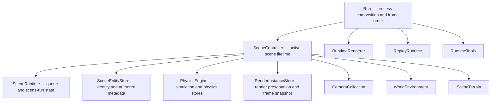
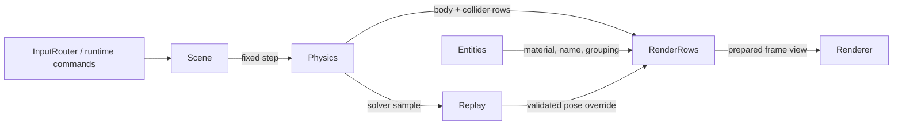

# SkullbonezCore Class Structure

This reference describes the current runtime ownership graph. It intentionally
focuses on durable owners and typed data boundaries rather than every helper.

## Top-level ownership

`Run` constructs concrete owners, sequences startup/shutdown and top-level frame
order, and pumps the operating-system window. Scene, replay, render, tools,
input, diagnostics, capture, and UI business state belongs to their concrete
owners.

## Scene identity and row ownership

`PhysicsSceneObjectId` is the one stable cross-system identity. Scene save/load,
undo, picking, logging, replay correlation, and future cross-system features use
it. A dense model row is only a temporary alignment hint.

`SceneEntityStore` owns:

- stable scene object identity;
- the current physics body handle;
- durable render material intent and display name;
- asset provenance;
- behavior grouping such as ragdoll or releasable-tree membership.

`PhysicsBodyStore` and `ColliderStore` own hot simulation rows. Their typed
handles and dense arrays stay inside physics-facing operations after a scene id
is resolved at the owner boundary.

`RenderInstanceStore` owns render presentation rows and the prepared instance
snapshot. Short fixed-contact timers live beside that presentation data; they
are not durable scene or deterministic physics state.

## Coordinated scene operations

`SceneController` owns the active scene's entity store, physics engine, render
instance store, cameras, world settings, and terrain. The implementation is
split by cohesion:

- `SceneController.cpp` handles scene state, physics stepping, navigation, and
  request policy.
- `SceneController.Objects.cpp` handles cross-store creation/deletion,
  topology repair at cold boundaries, render-instance preparation, and
  scene-scoped physics/debug packaging.
- `SceneController.Load.cpp` implements the cold scene load/save transaction.

Creation is a fail-before-mutation transaction: validate entity identity and
capacity, preflight physics and render rows, then publish entity, body,
collider, and render rows in the same dense order. Deletion is a cold swap-last
transaction across those same owners. No replacement all-domain context,
service bag, callback pack, or legacy model wrapper participates.

The test for "is this a bag?" is ownership, not the name: an aggregate is
legitimate only when it enforces a rule its absence would let a caller break, and
its header says which in an `Invariant:` block. A behavior-free aggregate whose
sole member borrows another owner, or one whose sole consumer destructures every
member at entry, owns nothing whatever it is called. A one-field behavior owner
or tested strong value type is not that parameter-wrapper shape. Reference-carrying view
structs are judged as one surface — if any
operation receives every slice, the split is nominal. See the Invariant Ownership,
Capability Slice Ownership, and Refactoring leftover rules in `AGENTS.md`.

## Frame data flow

Physics hot loops consume compact store arrays and bounded scratch buffers.
Owner-side UI, diagnostics, and replay work happens before or after those
loops through typed values or bounded side-effect queues.

## Rendering

`RuntimeRenderer` owns renderer policy and builds frame views. DX12 is the only
runtime backend. `RenderInstanceStore` supplies transform, bounds, material,
shape, fixed-state, and contact-feedback values without reopening scene
metadata during draw submission.

## Replay

`ReplayRecorder` owns retained presentation and solver samples.
`ReplayRuntime` owns scrub, prediction, branching, artifact IO, and replay
interaction policy. Replay body identity is validated against physics-owned
rows before a one-frame render pose override is accepted.

## Physics

`PhysicsEngine` owns `PhysicsScene`, which owns the physics body/collider stores,
solver state, broadphase, constraints, tornado state, and diagnostics streams.
`SimulationSystem` owns timestep policy. SceneController supplies world forces,
worker capability, and bounded diagnostic names to a step; it does not mirror
physics state into a second object model.

## Editor and tools

Editor and launcher paths receive `SceneController` only when they need a
coordinated scene mutation. Store-only reads resolve through the scene's
`PhysicsEngine`, `SceneEntityStore`, or prepared `RenderInstanceStore`. New
features should prefer the narrowest concrete owner available.

## Validation map

- Scene-controller or runtime ownership changes: `tools\validate_fast.bat` plus
  every affected focused runtime gate mapped in `AGENTS.md`.
- Physics behavior changes: `tools\validate_physics.bat`.
- Render/DX12 changes: `tools\validate_dx12_renderer.bat` and
  `tools\run_graphics_stress.bat 1`.
- Performance-sensitive hot paths: `tools\validate_perf.bat`.

See `AGENTS.md` for the authoritative gate mapping and policy details.
