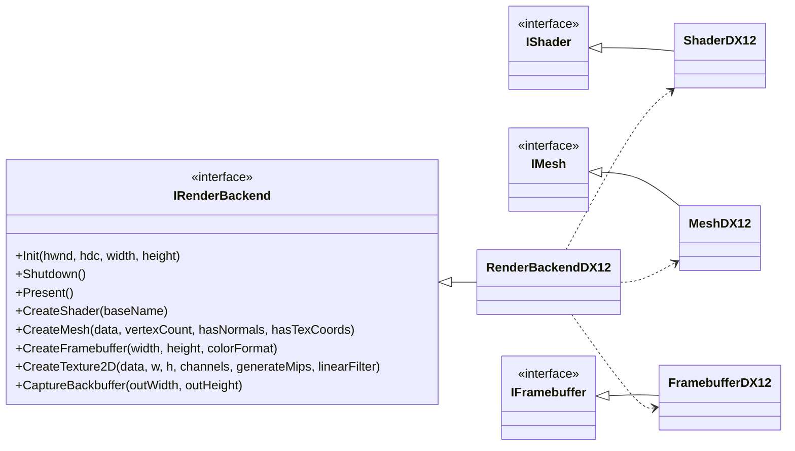
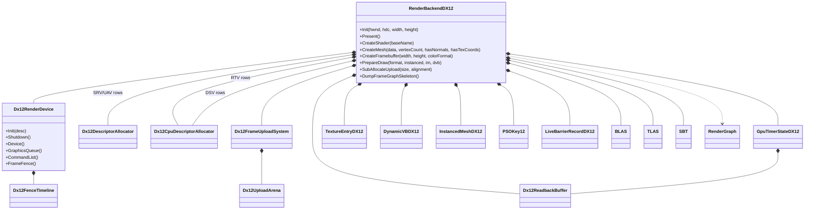
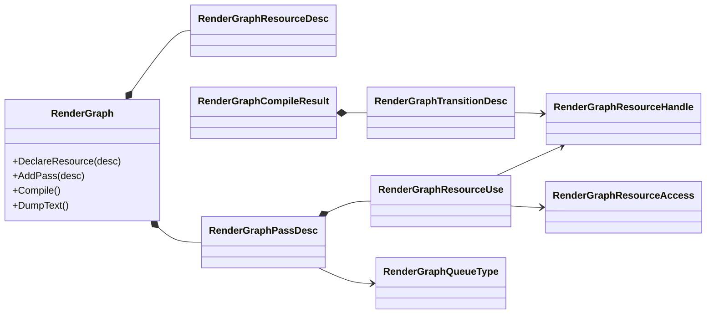
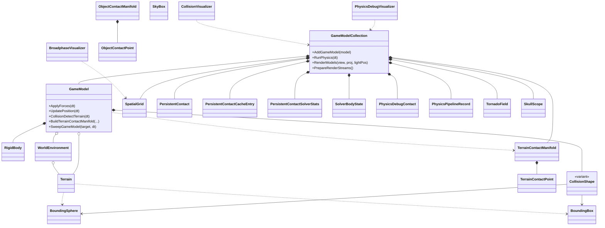
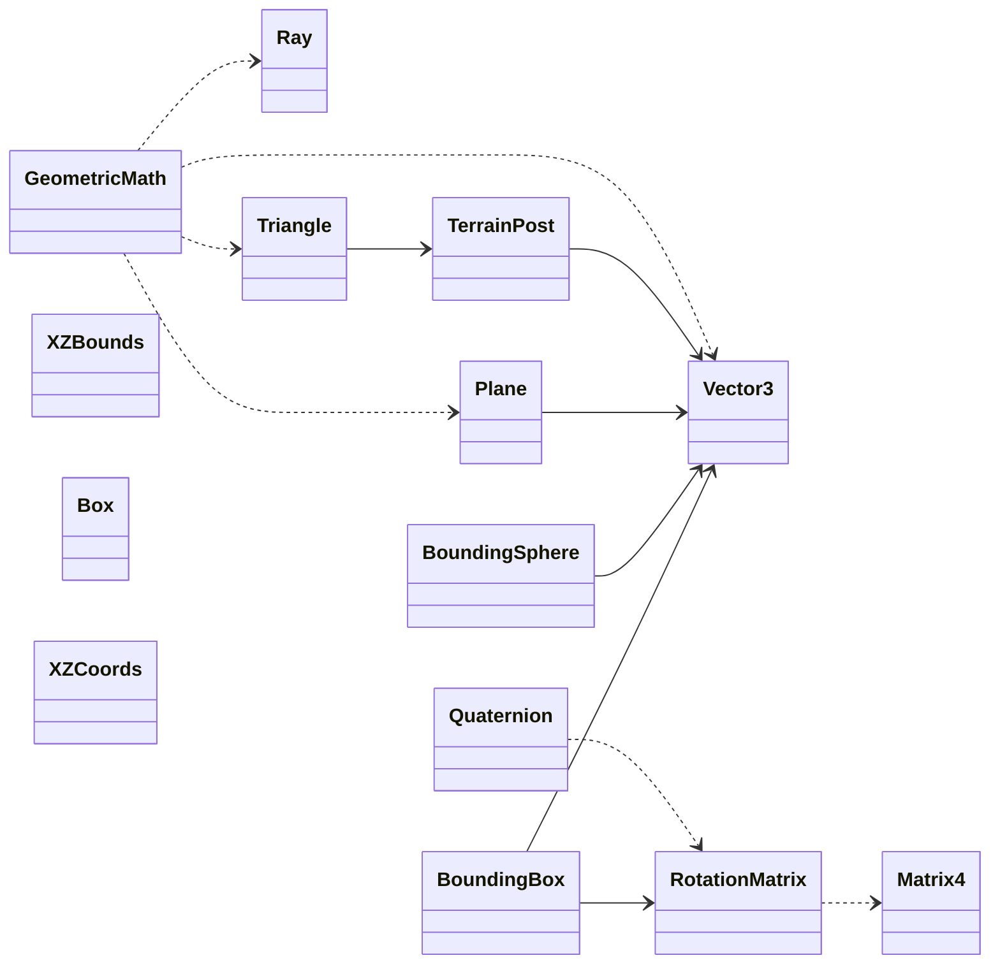
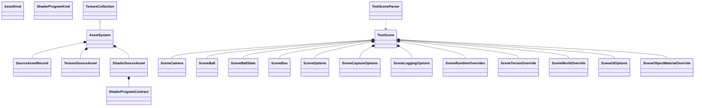
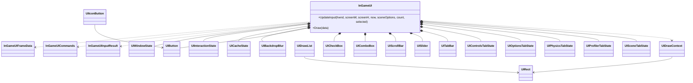

# SkullbonezCore Class Structure

This is a readable class-structure map for `SkullbonezSource/`.

It is intentionally layered. A single class diagram containing every helper
struct would be too dense to use, so the first diagrams show ownership and
inheritance by subsystem. The final catalog lists the declarations that the
diagrams summarize.

Validation: none required. This is a documentation-only reference.

## Legend

- Solid inheritance arrows mean "implements" or "derives from."
- Composition arrows mean a class owns the member.
- Dashed dependency arrows mean "uses", "creates", "selects", or "talks to."
- The catalog is header-oriented and includes key helper structs/enums because
  SkullbonezCore stores much of its runtime state in plain structs.

## Whole Engine Ownership Map

```mermaid
flowchart TB
    App["SkullbonezRun\nmain runtime harness"]

    subgraph Runtime["Runtime shell"]
        Window["SkullbonezWindow"]
        Input["Input / InputState"]
        InputController["InputController"]
        Timers["Timer / RunTimerState"]
        Config["SkullbonezConfig\nWindowConfig / render flags / cinematic config"]
        Capture["CaptureSystem"]
        RuntimeDiagnostics["RuntimeDiagnostics"]
        Text["Text2d"]
        Profiler["Profiler / ProfilerScope / GpuProfilerScope"]
        PlatformProfiler["PlatformProfiler"]
    end

    subgraph SceneAssets["Scene and assets"]
        AssetSystem["AssetSystem"]
        TestScene["TestScene\nscene data structs"]
        TextureCollection["TextureCollection\nsingleton texture registry"]
    end

    subgraph WorldPhysics["World, geometry, and physics"]
        WorldEnvironment["WorldEnvironment\nwater, gravity, drag"]
        Terrain["Terrain\nrender mesh + collision surface"]
        SkyBox["SkyBox"]
        GameModelCollection["GameModelCollection\nphysics traffic controller"]
        GameModel["GameModel\nrenderable physical object"]
        RigidBody["RigidBody"]
        CollisionShape["CollisionShape\nvariant"]
        BoundingSphere["BoundingSphere"]
        BoundingBox["BoundingBox"]
        SpatialGrid["SpatialGrid"]
        TornadoField["TornadoField"]
        PhysicsDebug["PhysicsDebugVisualizer"]
        CollisionViz["CollisionVisualizer"]
        BroadphaseViz["BroadphaseVisualizer"]
        SkullScope["SkullScope\nqueryable physics diagnostics"]
    end

    subgraph Rendering["Rendering facade and DX12 backend"]
        Gfx["Gfx() global backend accessor"]
        IRenderBackend["IRenderBackend"]
        RenderBackendDX12["RenderBackendDX12"]
        IShader["IShader"]
        IMesh["IMesh"]
        IFramebuffer["IFramebuffer"]
        RenderGraph["RenderGraph\ndiagnostic graph contract"]
    end

    subgraph DX12Internals["DX12 internals"]
        Dx12RenderDevice["Dx12RenderDevice"]
        Dx12FenceTimeline["Dx12FenceTimeline"]
        Dx12DescriptorAllocator["Dx12DescriptorAllocator\nSRV/UAV shader-visible rows"]
        Dx12CpuDescriptorAllocator["Dx12CpuDescriptorAllocator\nRTV/DSV CPU rows"]
        Dx12FrameUploadSystem["Dx12FrameUploadSystem"]
        Dx12ReadbackBuffer["Dx12ReadbackBuffer"]
        BLAS["BLAS"]
        TLAS["TLAS"]
        SBT["SBT"]
    end

    subgraph UI["In-game UI"]
        InGameUI["InGameUI"]
        UIFrameData["InGameUIFrameData"]
        UICommands["InGameUICommands"]
        Widgets["UIButton / UICheckBox / UISlider / UIComboBox / UITabBar"]
        UIDraw["UIDrawContext / UIDrawList / UIRect"]
        UIState["UIWindowState / UIInteractionState / tab state structs"]
        UICache["UICacheState"]
        UIBackdropBlur["UIBackdropBlur"]
    end

    App --> Window
    App --> Timers
    App --> Config
    App --> AssetSystem
    App --> GameModelCollection
    App --> WorldEnvironment
    App --> InGameUI
    App -.-> TextureCollection
    App -.-> Terrain
    App -.-> SkyBox
    App -.-> TestScene
    App -.-> Input
    App -.-> InputController
    App -.-> Capture
    App -.-> RuntimeDiagnostics
    App -.-> Text
    App -.-> Profiler
    App -.-> PlatformProfiler
    App -.-> Gfx

    Gfx --> IRenderBackend
    RenderBackendDX12 -. implements .-> IRenderBackend
    IRenderBackend -. creates .-> IShader
    IRenderBackend -. creates .-> IMesh
    IRenderBackend -. creates .-> IFramebuffer
    RenderBackendDX12 --> Dx12RenderDevice
    RenderBackendDX12 --> Dx12DescriptorAllocator
    RenderBackendDX12 --> Dx12CpuDescriptorAllocator
    RenderBackendDX12 --> Dx12FrameUploadSystem
    RenderBackendDX12 --> Dx12ReadbackBuffer
    RenderBackendDX12 --> BLAS
    RenderBackendDX12 --> TLAS
    RenderBackendDX12 --> SBT
    RenderBackendDX12 -.-> RenderGraph
    Dx12RenderDevice --> Dx12FenceTimeline

    GameModelCollection --> GameModel
    GameModelCollection --> SpatialGrid
    GameModelCollection --> TornadoField
    GameModelCollection --> SkullScope
    GameModelCollection -.-> PhysicsDebug
    GameModel --> RigidBody
    GameModel --> CollisionShape
    CollisionShape --> BoundingSphere
    CollisionShape --> BoundingBox
    GameModel -.-> WorldEnvironment
    GameModel -.-> Terrain
    WorldEnvironment -. creates .-> IMesh
    WorldEnvironment -. creates .-> IShader
    Terrain -. creates .-> IMesh
    Terrain -. creates .-> IShader

    InGameUI -. reads .-> UIFrameData
    InGameUI -. emits .-> UICommands
    InGameUI --> Widgets
    InGameUI --> UIState
    InGameUI --> UICache
    InGameUI --> UIBackdropBlur
    InGameUI -. draws with .-> UIDraw
```

## Runtime Harness

`SkullbonezRun` is the orchestration class. It owns the long-lived runtime
state, loads scenes, initializes DX12, runs physics ticks, renders frames,
drives the UI, captures screenshots, and coordinates validation/test modes.

```mermaid
classDiagram
direction TB

class SkullbonezRun {
  +Initialise()
  +RunSceneLoadOnly()
  +Run()
}

class RunPerfLogState
class RunPhysicsDiagnosticsState
class RunRuntimeSettings
class RunTimerState
class RunSubsystemState
class RunCameraState
class SceneRuntime
class SimulationSystem
class RuntimeDiagnostics
class InputController
class RunSceneState
class RunScreenshotState
class RunLiveStyleControlState
class RunDebugState
class RunFireState
class RunUIStressState
class SceneRuntimeResetSnapshot

class AssetSystem
class Terrain
class TextureCollection
class SkyBox
class SkullbonezWindow
class GameModelCollection
class WorldEnvironment
class InGameUI
class BroadphaseVisualizer
class CollisionVisualizer
class PhysicsDebugVisualizer

SkullbonezRun *-- RunPerfLogState
SkullbonezRun *-- RunPhysicsDiagnosticsState
SkullbonezRun *-- RunRuntimeSettings
SkullbonezRun *-- RunTimerState
SkullbonezRun *-- RunSubsystemState
SkullbonezRun *-- RunCameraState
SkullbonezRun *-- SceneRuntime
SkullbonezRun *-- SimulationSystem
SkullbonezRun ..> RuntimeDiagnostics
SkullbonezRun ..> InputController
SceneRuntime *-- RunSceneState
SkullbonezRun *-- RunScreenshotState
SkullbonezRun *-- RunLiveStyleControlState
SkullbonezRun *-- RunDebugState
SkullbonezRun *-- RunFireState
SkullbonezRun *-- RunUIStressState
SkullbonezRun ..> SceneRuntimeResetSnapshot

RunSubsystemState *-- AssetSystem
RunSubsystemState o-- Terrain
RunSubsystemState o-- TextureCollection
RunSubsystemState o-- SkyBox
RunSubsystemState o-- SkullbonezWindow
SkullbonezRun *-- GameModelCollection
SkullbonezRun *-- WorldEnvironment
SkullbonezRun *-- InGameUI
SkullbonezRun *-- BroadphaseVisualizer
SkullbonezRun *-- CollisionVisualizer
SkullbonezRun *-- PhysicsDebugVisualizer
```

`SceneRuntime` is now an owned runtime subsystem for scene queue/index state and
`RunSceneState`. `SimulationSystem` owns timestep policy and the physics
accumulators for fixed-step and variable-step playback. `CaptureSystem` owns
BMP backbuffer readback plus scene screenshot/autocycle policy. `RuntimeDiagnostics`
owns perf CSV, scene-finished, and SkullScope run logging policy. `InputController`
owns runtime key-edge capture plus mouse-look reset/delta policy. `SkullbonezRun`
still applies input commands and capture completion actions such as scene
advance, quit, or interactive hold, then coordinates the heavier load/reset side
effects around that state, including object construction, terrain, cameras, UI
defaults, diagnostics context, and renderer setup.

## Rendering Interfaces And Backend Family

`IRenderBackend` is the engine-facing renderer facade. DX12 is now the only
runtime implementation. The interface still carries some broad, backend-shaped
names because Phase 7 of the retirement plan will decide what becomes a clean
future backend contract and what should move behind DX12-owned subsystem types.

## DX12 Backend Detail

The DX12 backend is a facade around renderer features. `Dx12RenderDevice` now
owns the low-level factory/device/queue/swap-chain/fence lifetime, while helper
allocators own the explicit DX12 table and upload-buffer policies.

## Render Graph Contract

The render graph is not yet the live renderer. It is the contract and diagnostic
path that describes resources, passes, and intended transitions.

## Scene, Physics, Geometry, And World

Physics ownership flows through `GameModelCollection`. Individual `GameModel`
objects own their body and collision shape; the collection sees all objects and
therefore owns broadphase, contact caches, solver rows, sleep policy, and
diagnostics.

## Math And Geometry Primitives

The math layer is mostly value types and free-function helpers. These are used
across rendering, terrain, collision, camera, and physics.

## Scene And Asset Data

Scene files produce `TestScene`, which holds declarative scene data. The runtime
uses it to build cameras, world settings, terrain overrides, physics objects,
render/debug toggles, and UI state.

## UI Structure

The UI reads `InGameUIFrameData` and emits `InGameUICommands`. It does not own
engine simulation objects directly; the runtime applies the commands.

## Complete Declaration Catalog

This catalog keeps the diagrams grounded in the headers. It is grouped by
subsystem rather than by dependency edge.

### Runtime, Window, Input, Config, Profiling

- `SkullbonezRun`
- `RunPerfLogState`
- `RunPhysicsDiagnosticsState`
- `RunRuntimeSettings`
- `RunTimerState`
- `RunSubsystemState`
- `RunCameraState`
- `RunSceneState`
- `RunScreenshotState`
- `RunLiveStyleControlState`
- `RunDebugState`
- `RunFireState`
- `RunUIStressState`
- `SceneRuntimeResetSnapshot`
- `RuntimeDiagnostics`
- `RuntimePerfTickContext`
- `GeneratedObjectTypeOverride`
- `OverlayMode`
- `SkullbonezWindow`
- `InputState`
- `Input`
- `InputController`
- `RuntimeKeyEdge`
- `Timer`
- `CaptureSystem`
- `RuntimeCaptureSceneContext`
- `RuntimeCaptureResult`
- `RuntimeCaptureSink`
- `SkullbonezConfig`
- `WindowConfig`
- `RuntimeRenderFlags`
- `SceneLightConfig`
- `CinematicRenderConfig`
- `Profiler`
- `ProfilerScope`
- `GpuProfilerScope`
- `PlatformProfiler`
- `SkullbonezLog`
- `SkullbonezHelper`
- `ResponseInformation`

### Rendering Interfaces And Render Types

- `IRenderBackend`
- `RenderCapabilities`
- `BlendFactor`
- `IShader`
- `IMesh`
- `IFramebuffer`
- `FramebufferColorFormat`
- `ShadowFrameData`
- Global backend functions: `Gfx()`, `IsGfxReady()`, `SetGfxBackend()`, `DestroyGfxBackend()`

### DirectX 12 Backend And DXR

- `RenderBackendDX12`
- `ShaderDX12`
- `MeshDX12`
- `FramebufferDX12`
- `Dx12RenderDevice`
- `Dx12RenderDeviceInitDesc`
- `Dx12FenceTimeline`
- `Dx12FenceTimelineStats`
- `Dx12DescriptorAllocator`
- `Dx12DescriptorAllocatorStats`
- `Dx12CpuDescriptorAllocator`
- `Dx12CpuDescriptorAllocatorStats`
- `Dx12CpuDescriptorAllocation`
- `Dx12UploadArena`
- `Dx12UploadArenaStats`
- `Dx12FrameUploadSystem`
- `Dx12ReadbackBuffer`
- `Dx12ReadbackBufferStats`
- `TextureEntryDX12`
- `DynamicVBDX12`
- `InstancedMeshDX12`
- `PSOKey12`
- `GpuTimerStateDX12`
- `LiveBarrierRecordDX12`
- `VertexFormat12`
- `BLAS`
- `TLAS`
- `SBT`

### Render Graph

- `RenderGraph`
- `RenderGraphQueueType`
- `RenderGraphResourceAccess`
- `RenderGraphResourceHandle`
- `RenderGraphResourceDesc`
- `RenderGraphResourceUse`
- `RenderGraphPassDesc`
- `RenderGraphTransitionDesc`
- `RenderGraphCompileResult`

### Scene, Assets, Textures

- `AssetSystem`
- `AssetKind`
- `ShaderProgramKind`
- `ShaderProgramContract`
- `SourceAssetRecord`
- `TextureSourceAsset`
- `ShaderSourceAsset`
- `TextureCollection`
- `TestScene`
- `TestSceneParser`
- `SceneCamera`
- `SceneBall`
- `SceneBallState`
- `SceneBox`
- `SceneObjectMaterialOverride`
- `SceneOptions`
- `SceneCaptureOptions`
- `SceneLoggingOptions`
- `SceneRuntimeOverrides`
- `SceneTerrainOverride`
- `SceneWorldOverride`
- `SceneUIOptions`

### World, Geometry, And Math

- `WorldEnvironment`
- `Terrain`
- `SkyBox`
- `Text2d`
- `TerrainPost`
- `Triangle`
- `Plane`
- `XZBounds`
- `Box`
- `XZCoords`
- `Ray`
- `GeometricMath`
- `Vector3`
- `Matrix4`
- `RotationMatrix`
- `Quaternion`
- `PrimitiveMeshBuilder` helper structs: `VertexPNUV`, `LocalVertex`, `CubeFace`

### Collision And Physics

- `GameModel`
- `GameModelCollection`
- `RigidBody`
- `CollisionShape`
- `BoundingSphere`
- `BoundingBox`
- `TerrainContactPoint`
- `TerrainContactManifold`
- `ObjectContactPoint`
- `ObjectContactManifold`
- `SpatialGrid`
- `SpatialGrid::Entry`
- `SpatialGrid::Bucket`
- `SpatialGrid::ActiveCell`
- `TornadoField`
- `TornadoFieldConfig`
- `PhysicsDebugVisualizer`
- `PhysicsPipelineStage`
- `PhysicsPipelineRecord`
- `PhysicsDebugContact`
- `CollisionVisualizer`
- `BroadphaseVisualizer`
- `BoxTerrainVertexSupportProbe`
- `BoxTerrainSupportClassification`
- `SkullScope`

### UI

- `InGameUI`
- `InGameUITab`
- `InGameUIFrameData`
- `InGameUICommands`
- `InGameUIInputResult`
- `UIOnlyCommands`
- `UIRendererCommands`
- `UISceneCommands`
- `UIPhysicsCommands`
- `UISceneOptionCommands`
- `UIWaterCommands`
- `UIRunCommands`
- `UICinematicCommands`
- `UICinematicParam`
- `UICinematicFeature`
- `UIButton`
- `UICheckBox`
- `UIComboBox`
- `UIIconButton`
- `UIScrollBar`
- `UISlider`
- `UITabBar`
- `UIBackdropBlur`
- `UIBackdropBlurInvalidationReason`
- `UICacheState`
- `UICacheFrameKey`
- `UIDrawContext`
- `UIDrawList`
- `UIDrawList::CommandType`
- `UIDrawList::Stats`
- `UIDrawList::Command`
- `UIRect`
- `UIInputSnapshot`
- `UIWindowState`
- `UIInteractionState`
- `UIColor`
- `FooterToggleStyle`
- `UIPalette`
- `UIRadii`
- `UITextStyle`
- `UIControlStyle`
- `TitleButtonIcon`
- `TitleButtonRects`
- `UIControlsTabState`
- `UIOptionsTabState`
- `UIPhysicsTabState`
- `UIProfilerTabState`
- `TimelineSegment`
- `PerformanceHistogramSample`
- `UISceneTabState`

## Reading Notes

- `CollisionShape` is a `std::variant<BoundingSphere, BoundingBox>`, not a base
  class hierarchy.
- `TextureCollection` and `SkyBox` are singleton-style classes.
- `Gfx()` hides the active DX12 implementation behind `IRenderBackend`; runtime
  renderer switching has been retired.
- `RenderBackendDX12` is split across multiple `.cpp` files but remains one
  class in `SkullbonezRenderBackendDX12.h`.
- `RenderGraph` is currently diagnostic scaffolding. Live rendering still
  records commands through `RenderBackendDX12`.
- Many nested solver/UI structs are intentionally plain data. They are listed
  because they are part of the runtime architecture even though they are not
  polymorphic classes.
