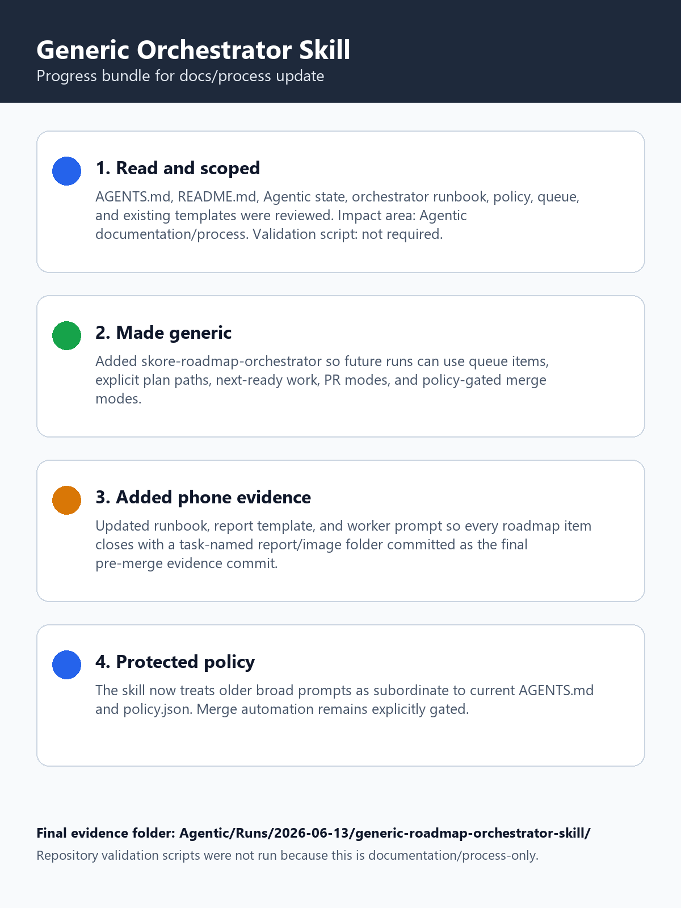
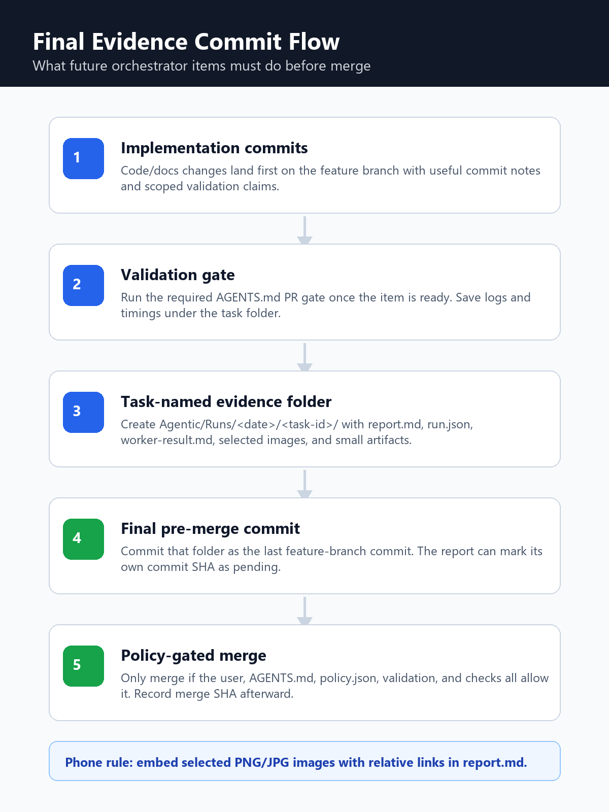

# Roadmap Item Report: generic-roadmap-orchestrator-skill

## What Changed, In Plain English

The orchestrator got a reusable instruction set for running roadmap work. Before
this, the process lived mostly in one-off prompts and local run notes. The new
skill and runbook tell future agents how to pick one queued task, hand it to a
worker, validate it, create a phone-readable report, and stop safely when policy
does not allow the next step.

This report is historical: it was created before the repo switched from
committed `Agentic/Runs` evidence folders to final report-only commits under
`Agentic/Reports`.

## At A Glance

- Source request: make the last roadmap-orchestrator prompt generic and add a committed phone-readable report/image bundle requirement.
- Branch: `main`
- Implementation commits: `67b37696`, `e79e3e84`
- Report commit: historical report migrated from `Agentic/Runs`.
- PR: not opened; user explicitly asked to do this on `main` after pulling.
- Merge SHA: not applicable.
- Final status: ready to commit evidence bundle.
- Started: approximately `2026-06-13T13:08+10:00`
- Finished: `2026-06-13T13:21+10:00` at report generation.
- Elapsed: approximately 13 minutes to report generation, plus final commit time.

## Progress Timeline

- Read `AGENTS.md`, `README.md`, `Agentic/README.md`, `Agentic/SessionState.md`, orchestrator policy/runbook/queue, and existing templates.
- Classified the change as Agentic documentation/process work; no repository validation script required.
- Added `Agentic/Skills/skore-roadmap-orchestrator/skill.md` as the generic kickoff skill.
- Updated orchestrator README, runbook, report template, and worker prompt to require task-named evidence folders.
- User clarified the work should land directly on `main`; stashed work, switched to `main`, ran `git pull --ff-only`, and reapplied the work.
- Committed implementation docs, then clarified that a report inside the evidence commit cannot know that commit SHA until after commit creation.
- Created this task-named evidence folder with report, worker note, metadata, validation note, and phone-readable images.

## Timings

- Initial instruction/template review: about 4 minutes.
- Generic skill and template edits: about 6 minutes.
- Main synchronization: under 1 minute; `git pull --ff-only` reported already up to date.
- Evidence image generation: under 1 minute.
- Repository validation scripts: not run because this was documentation/process-only.

## Implementation

The new `skore-roadmap-orchestrator` skill replaces a hard-coded kickoff prompt
with a reusable workflow. It accepts explicit plans, queue item ids, next-ready
queue execution, and bounded item counts. It also makes old broad authority
prompts subordinate to the current `AGENTS.md` and `policy.json`.

At the time this report was produced, the orchestrator runbook and templates
required every roadmap item to close with a task-named evidence folder under
`Agentic/Runs/<date>/<task-id>/`. That policy has since changed: durable
user-facing reports now live under `Agentic/Reports/<date>/<task-id>/`, and the
final report commit contains only `report.md` plus images referenced by it.

## Changed Files

- Generic skill: `Agentic/Skills/skore-roadmap-orchestrator/skill.md`
- Orchestrator discoverability: `Agentic/Orchestrator/README.md`
- Manual process contract: `Agentic/Orchestrator/runbook.md`
- Report shape: `Agentic/Orchestrator/templates/report.md`
- Worker handoff expectations: `Agentic/Orchestrator/templates/worker-prompt.md`
- This migrated report: `Agentic/Reports/2026-06-13/generic-roadmap-orchestrator-skill/report.md`

## Validation

- Required gate: none; documentation/process-only change.
- Commands run:

```text
git pull --ff-only
git diff --check
```

- Result:

```text
git pull --ff-only: Already up to date.
git diff --check: passed with no output.
```

## Screenshots And Artifacts

- Report: `Agentic/Reports/2026-06-13/generic-roadmap-orchestrator-skill/report.md`
- Images: `Agentic/Reports/2026-06-13/generic-roadmap-orchestrator-skill/images/`

## Phone-Readable Images





## Interesting Code Snippets

Generic kickoff prompt from `Agentic/Skills/skore-roadmap-orchestrator/skill.md`:

```text
Run scope:
- Queue source: <Agentic/Orchestrator/queue.json or explicit plans>
- Items: <next ready item | item ids | plan paths | N items>
- PR mode: <none | create/update PR when policy allows>
- Merge mode: <do not merge | merge only when policy, checks, and user permission allow>
```

Final evidence commit gate from `Agentic/Skills/skore-roadmap-orchestrator/skill.md`:

```text
Commit implementation changes first, then make the final pre-merge commit a
task-named run evidence folder commit containing report.md, run.json,
worker-result.md, selected images, and any small useful artifacts.
```

Phone image/report expectation from `Agentic/Orchestrator/runbook.md`:

```text
Prefer PNG or JPG for committed phone-review images. If the runtime produces BMP
captures, convert selected captures to PNG before embedding them in report.md.
```

## PR Status

No PR was opened. The user explicitly asked to do this on `main` and to pull
first; `main` was already up to date with `origin/main`.

## Merge Status

Not applicable. This work is being committed directly on `main` with explicit
user permission.

## Conflicts

No conflicts. The work was stashed, `main` was pulled with fast-forward only,
and the stash reapplied cleanly.

## Residual Risk

The skill is a manual/process contract. It does not implement an automated
orchestrator script, image conversion helper, or PR creation helper. Future
orchestrator runs still need an agent to follow the skill and runbook.

## Sub-Agent Result Summary

No sub-agent was spawned for this docs/process task. The current agent performed
the work directly. The original local worker-result file was removed when
historical run state was purged from source control.

## Next Queue Action

Commit this evidence folder as the final piece for the task.
