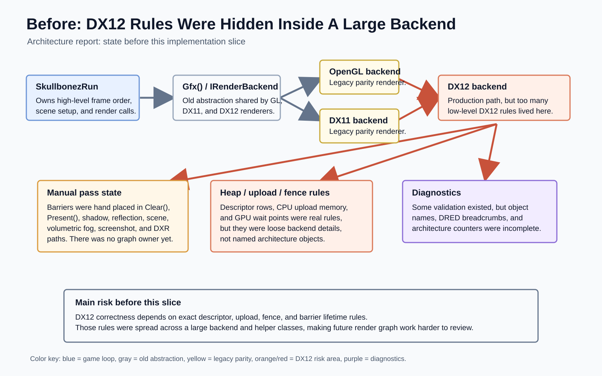
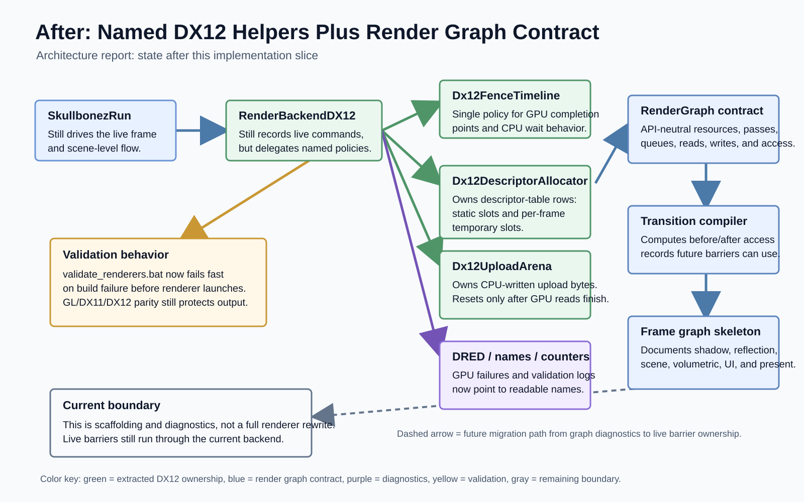

# Roadmap Item Report: dx12-only-engine-architecture

## What Changed, In Plain English

The DX12 renderer is being turned from one very large, hard-to-reason-about backend into a set of named systems with clear jobs. That matters because modern DirectX 12 asks the engine to manage details older render APIs hid: which table row points at a texture, which temporary upload buffer is safe to reuse, which command allocator belongs to the current frame, and exactly when a resource changes from "being rendered into" to "being sampled from" or "being presented on screen."

This report now covers both the original architecture slice and the follow-up five-item pass. The follow-up pass split the huge DX12 backend file into focused implementation files, moved swap-chain/device/queue/fence ownership into `Dx12RenderDevice`, gave render-target and depth-buffer descriptor tables their own allocator, moved upload/readback lifetime into small helper systems, and added a diagnostic comparison between the planned render graph barriers and the barriers the live backend actually emits today.

The old architecture shape concentrated too many responsibilities in one production renderer file:



The branch created a more explicit architecture boundary. At the time, DX12 was the production renderer while GL and DX11 still remained parity references for validation; current stacked work has since retired those runtime paths. The render graph is still diagnostic scaffolding, but the backend now exposes enough device, descriptor, upload, readback, and live-barrier structure to move toward graph-owned rendering in smaller, safer steps:



The historical validation workflow was also made less brittle. The renderer validation batch then used by this branch fails fast when the build fails, instead of continuing into renderer launches that can make agents appear stuck. Every implementation slice was committed and pushed in small atomic commits, with renderer parity checks run repeatedly against GL, DX11, and DX12 as requested.

This report closes the current orchestrator queue item and records the follow-up architecture pass. It does not claim that the final DX12-only architecture is complete. Remaining work includes making the graph drive live barriers, moving passes into graph callbacks, replacing name-based shader setters, and building the material/resource systems described by the source and follow-up plans.

## 2026-06-15 Cleanup Note

Read the validation and GL/DX11 references below as historical evidence from
the original architecture branch. The current stack has since added DX12-only
renderer retirement, Debug shader contract diagnostics, a CPU `RenderMaterial`
bridge, and the documented ordinary raster binding ABI (`b0`, `t0..t3`, static
samplers `s0`, `s1`, and `s3`). Current renderer PR gates should use
`tools\validate_dx12_renderer.bat`; GL/DX11 parity is archived context, not an
active runtime safety net.

## At A Glance

- Source plan: `Agentic/Plans/dx12-only-engine-architecture-plan.md`
- Archived plan: `Agentic/Plans/Done/dx12-only-engine-architecture-plan.md`
- Follow-up plan: `Agentic/Plans/dx12-final-architecture-next-steps.md`
- Branch: `codex/dx12-only-engine-architecture`
- Implementation commits:
  - `7ff83dad` fix renderer validation fail-fast behavior
  - `8bbca94e` extract DX12 descriptor and upload allocators
  - `a7d119f0` add DX12 diagnostics naming and DRED setup
  - `fc073fb5` centralize DX12 fence timeline
  - `77b212ac` name DX12 pipeline diagnostics
  - `612ae9ff` add render graph contract
  - `2b57b4e1` compile render graph transitions
  - `7fcdc527` dump DX12 frame graph skeleton
  - `23618b64` require orchestrator reports before completion
  - `c79c87a4` plan DX12 final architecture steps
  - `5e4edfa6` split DX12 backend subsystems
  - `eca2f551` extract DX12 render device owner
  - `becff60c` allocate DX12 RTV/DSV descriptors
  - `f75a9218` extract DX12 upload/readback systems
  - `1d31a430` compare DX12 graph and live barriers
- Queue/status commit: `ce381d07`
- Original report commit: `6f22d27a`
- Diagram update commit: `a94be467`
- Latest report update commit: this commit; exact SHA reported in final response
- Report web URL: https://github.com/skullbonez/SkullbonezCore/blob/codex/dx12-only-engine-architecture/Agentic/Reports/2026-06-14/dx12-only-engine-architecture/report.md
- PR: none opened
- Merge SHA: none
- Final status: `done`
- Queue status: `done`
- Started: `2026-06-13T21:54:57+10:00`
- Original report finished: `2026-06-14T08:59:48+10:00`
- Follow-up architecture pass finished: `2026-06-14T12:12:06+10:00`
- Report update finished: `2026-06-14T12:27:14+10:00`
- Elapsed: original orchestrator run about 11h 5m; follow-up five-item architecture pass about 50m 46s; this report update timed separately in the final response

## Progress Timeline

- Queued `dx12-only-engine-architecture` as the only orchestrator queue item and enabled the policy.
- Fixed `tools\validate_renderers.bat` so build failures stop the script before GL, DX11, or DX12 launches.
- Extracted DX12 descriptor allocation and upload arena policy from loose backend counters.
- Added DX12 DRED setup and human-readable names for major DX12 objects.
- Centralized frame fence signaling and waits in `Dx12FenceTimeline`.
- Named PSOs, root signatures, raytracing objects, readback resources, and other diagnostic objects.
- Added a heavily commented API-neutral `RenderGraph` contract.
- Added a first graph compile step that emits resource transition records.
- Added a diagnostic DX12 frame graph skeleton dump for current major passes and resources.
- Updated orchestrator documents so future runs require a committed report plus terminal queue status before finalizing.
- Archived the original source plan and marked the queue item `done`.
- Added `Agentic\Plans\dx12-final-architecture-next-steps.md` to capture the next five architecture slices.
- Split `SkullbonezRenderBackendDX12.cpp` into focused files for DXR, dynamic geometry, pipeline setup, profiling, readback, resources, and textures.
- Extracted `Dx12RenderDevice` so device, factory, queue, swap chain, command allocators, and frame fence ownership now live behind one device owner.
- Added CPU-only RTV and DSV descriptor allocators so render-target and depth-stencil table rows are owned explicitly instead of being hand-calculated in the backend.
- Extracted `Dx12FrameUploadSystem` and `Dx12ReadbackBuffer` so upload memory and CPU-readable GPU result buffers have named lifetime owners.
- Added live-barrier recording and `GraphVsLiveTransitionStatePairs` diagnostics so the current render graph skeleton can be compared against real backend transitions.

## Timings

- `tools\validate_renderers.bat` after fail-fast batch fix: 35.8s, passed.
- `tools\validate_renderers.bat` after DX12 diagnostics/comment expansion: 58.9s, passed.
- `tools\validate_build.bat Profile` after fence timeline: 23.5s, passed.
- `tools\validate_renderers.bat` after fence timeline: 36.4s, passed.
- `tools\validate_build.bat Profile` after pipeline diagnostic names: 3.9s, passed.
- `tools\validate_renderers.bat` after pipeline diagnostic names: 19.1s, passed.
- `tools\validate_build.bat Profile` after render graph contract/comments: 24.3s, passed.
- `tools\validate_renderers.bat` after render graph contract/comments: 37.3s, passed.
- `tools\validate_build.bat Profile` after render graph transition compiler: 2.7s, passed.
- First transition-compiler renderer validation attempt: 2.8s, failed fast on formatting before renderer launches.
- `tools\format_fix.bat` after formatting failure: 2.9s, ran; unrelated formatter churn was reverted before commit.
- `tools\validate_renderers.bat` transition-compiler rerun: 63.4s, passed.
- `tools\validate_build.bat Profile` after frame graph skeleton: 22.8s, passed.
- `tools\validate_renderers.bat` after frame graph skeleton: 36.1s, passed.
- Follow-up pass item 2 renderer gate: 46.5s, passed.
- Follow-up pass item 3 Profile build: 31.7s, passed.
- Follow-up pass item 3 renderer gate: 44.2s, passed.
- Follow-up pass item 4 Profile build: 32.0s, passed.
- Follow-up pass item 4 renderer gate: 44.3s, passed.
- Follow-up pass item 5 Profile build: 31.1s, passed.
- Follow-up pass item 5 renderer gate: 44.6s, passed.
- Follow-up pass item 5 diagnostic rerun after Profile file-write fix: 21.8s, passed.
- Overall follow-up five-item architecture pass: about 50m 46s wall clock.
- Orchestrator safeguard documentation and this report update: documentation-only; no validation script required.

## Implementation

### Validation Batch

`tools\validate_renderers.bat` now builds Profile first and fails immediately if the build fails. Renderer launches are guarded by PID-scoped timeout handling, so a compile failure no longer cascades into repeated renderer launch attempts.

### DX12 Device-Adjacent Helpers

`SkullbonezRenderDeviceDX12.h/.cpp` now contains:

- `Dx12DescriptorAllocator`, which explains and manages static descriptor slots and per-frame transient descriptor rows.
- `Dx12CpuDescriptorAllocator`, which owns CPU-only rows for render-target views and depth-stencil views.
- `Dx12UploadArena`, which explains and manages CPU-written upload memory with fence-safe per-frame reset.
- `Dx12FrameUploadSystem`, which owns per-frame upload resources and mapped CPU pointers.
- `Dx12ReadbackBuffer`, which owns CPU-readable GPU result buffers used for profiler and screenshot readback.
- `Dx12FenceTimeline`, which centralizes fence signaling and waiting.
- `Dx12RenderDevice`, which now owns the DXGI factory, D3D12 device, command queue, swap chain, command allocators, command list, fence, and fence event.
- DRED and object-naming helpers so validation and device removal reports point to human-readable objects.

### Backend Decomposition

The DX12 backend is no longer concentrated in a single enormous implementation file. The follow-up pass split it into focused files:

- `SkullbonezRenderBackendDX12.DXR.cpp`
- `SkullbonezRenderBackendDX12.DynamicGeometry.cpp`
- `SkullbonezRenderBackendDX12.Pipeline.cpp`
- `SkullbonezRenderBackendDX12.Profiler.cpp`
- `SkullbonezRenderBackendDX12.Readback.cpp`
- `SkullbonezRenderBackendDX12.Resources.cpp`
- `SkullbonezRenderBackendDX12.Textures.cpp`

This is not just cosmetic. It makes later architecture work safer because pipeline creation, texture handling, readback, dynamic geometry, DXR, and resource helpers can now change independently without turning every edit into a search through the whole renderer.

### Backend Integration

`SkullbonezRenderBackendDX12.cpp/.h` now uses the helper systems for descriptor allocation, upload suballocation, frame allocator waits, full GPU drains, timer readback waits, screenshot readback waits, architecture usage stats, and graph-vs-live barrier diagnostics.

### Render Graph

`SkullbonezRenderGraph.h/.cpp` adds:

- API-neutral graph resource declarations.
- Pass declarations with queue type, reads, and writes.
- Resource access declarations such as `RenderTarget`, `DepthWrite`, `PixelShaderResource`, `UnorderedAccess`, and `Present`.
- `RenderGraphCompileResult`, which lists transition records before passes.
- `DumpText()`, which prints resources, passes, and computed transitions.

This is still scaffolding. The current renderer still records live DX12 commands and barriers through the existing backend path. The important improvement is that the branch can now print both the intended graph transitions and the real backend transitions in one diagnostic file.

### Comments For Non-GPU Engineers

The render architecture comments now explain descriptor heaps, descriptor allocators, CPU descriptor allocators, SRVs, UAVs, RTVs, DSVs, upload arenas, readback buffers, fences, command allocators, root signatures, root descriptor tables, PSOs, resource barriers, swap-chain ownership, and render graph transitions in plain C++ engineering terms.

### Orchestrator Safeguards

The orchestrator documents now explicitly forbid successful finalization after code push alone. A terminal queue status and a committed report are required. The report template also asks agents to embed useful visuals near the relevant text, not as unrelated attachments.

## Changed Files

Important implementation files from the original architecture slice:

- `tools\validate_renderers.bat`
- `AGENTS.md`
- `SKULLBONEZ_CORE.vcxproj`
- `SKULLBONEZ_CORE.vcxproj.filters`
- `SkullbonezSource\SkullbonezRenderBackendDX12.cpp`
- `SkullbonezSource\SkullbonezRenderBackendDX12.h`
- `SkullbonezSource\SkullbonezRenderDeviceDX12.cpp`
- `SkullbonezSource\SkullbonezRenderDeviceDX12.h`
- `SkullbonezSource\SkullbonezRenderGraph.cpp`
- `SkullbonezSource\SkullbonezRenderGraph.h`

Important implementation files from the follow-up five-item architecture pass:

- `Agentic\Plans\dx12-final-architecture-next-steps.md`
- `SkullbonezSource\SkullbonezRenderBackendDX12.DXR.cpp`
- `SkullbonezSource\SkullbonezRenderBackendDX12.DynamicGeometry.cpp`
- `SkullbonezSource\SkullbonezRenderBackendDX12.Pipeline.cpp`
- `SkullbonezSource\SkullbonezRenderBackendDX12.Profiler.cpp`
- `SkullbonezSource\SkullbonezRenderBackendDX12.Readback.cpp`
- `SkullbonezSource\SkullbonezRenderBackendDX12.Resources.cpp`
- `SkullbonezSource\SkullbonezRenderBackendDX12.Textures.cpp`
- `SkullbonezSource\SkullbonezRenderBackendDX12.cpp`
- `SkullbonezSource\SkullbonezRenderBackendDX12.h`
- `SkullbonezSource\SkullbonezRenderDeviceDX12.cpp`
- `SkullbonezSource\SkullbonezRenderDeviceDX12.h`
- `SKULLBONEZ_CORE.vcxproj`
- `SKULLBONEZ_CORE.vcxproj.filters`

Orchestrator/reporting files:

- `Agentic\Orchestrator\README.md`
- `Agentic\Orchestrator\queue.json`
- `Agentic\Orchestrator\runbook.md`
- `Agentic\Orchestrator\templates\report.md`
- `Agentic\Orchestrator\templates\worker-prompt.md`
- `Agentic\Plans\Done\dx12-only-engine-architecture-plan.md`
- `Agentic\Reports\2026-06-14\dx12-only-engine-architecture\report.md`
- `Agentic\Reports\2026-06-14\dx12-only-engine-architecture\images\architecture-before.svg`
- `Agentic\Reports\2026-06-14\dx12-only-engine-architecture\images\architecture-after.svg`

This report update commit is intentionally report-only and should stage only `Agentic\Reports\2026-06-14\dx12-only-engine-architecture\report.md`.

## Validation

- Required gate for the render architecture work at the time:
  `tools\validate_renderers.bat`; current DX12-only renderer equivalent:
  `tools\validate_dx12_renderer.bat`
- Validation required for this report-only update: none
- Commands run during implementation:

```text
tools\validate_build.bat Profile
tools\validate_renderers.bat
tools\format_fix.bat
tools\validate_renderers.bat
tools\validate_build.bat Profile
tools\validate_renderers.bat
python tools\check_parity.py --manifest TestOutput\validation\renderers\20260614T020056Z\manifest.json
```

- Latest historical renderer result from that branch:

```text
tools\validate_renderers.bat: PASS
Formatting: PASS
Profile build: PASS
Debug build: PASS
DX12 InfoQueue validation errors: 0
Cross-renderer parity: PASS
water_ball_test GL vs DX11 avg_diff=2.8648
water_ball_test GL vs DX12 avg_diff=2.9023
solver_smoke GL vs DX11 avg_diff=1.2577
solver_smoke GL vs DX12 avg_diff=1.2130
```

Representative validation logs and artifacts:

```text
Agentic/Runs/2026-06-13/dx12-only-engine-architecture/validate_renderers_after_frame_graph_skeleton.log
TestOutput/validation/renderers/20260613T130434Z/manifest.json
TestOutput/validation/renderers/20260614T020056Z/manifest.json
TestOutput/validation/renderers/20260614T020056Z/summary.json
```

## Screenshots And Artifacts

The before/after architecture diagrams are embedded in the plain-language section above because they explain the architecture change directly. They are committed under:

```text
Agentic/Reports/2026-06-14/dx12-only-engine-architecture/images/architecture-before.svg
Agentic/Reports/2026-06-14/dx12-only-engine-architecture/images/architecture-after.svg
```

Renderer comparison artifacts from the original report run were generated under:

```text
TestOutput/validation/renderers/20260613T130434Z/
```

Renderer comparison artifacts from the follow-up architecture pass were generated under:

```text
TestOutput/validation/renderers/20260614T020056Z/
```

Useful generated files from the latest renderer run include:

```text
TestOutput/validation/renderers/20260614T020056Z/water_ball_test_gl_vs_dx11_side_by_side.png
TestOutput/validation/renderers/20260614T020056Z/water_ball_test_gl_vs_dx11_heatmap.png
TestOutput/validation/renderers/20260614T020056Z/water_ball_test_gl_vs_dx12_side_by_side.png
TestOutput/validation/renderers/20260614T020056Z/water_ball_test_gl_vs_dx12_heatmap.png
TestOutput/validation/renderers/20260614T020056Z/solver_smoke_gl_vs_dx11_side_by_side.png
TestOutput/validation/renderers/20260614T020056Z/solver_smoke_gl_vs_dx11_heatmap.png
TestOutput/validation/renderers/20260614T020056Z/solver_smoke_gl_vs_dx12_side_by_side.png
TestOutput/validation/renderers/20260614T020056Z/solver_smoke_gl_vs_dx12_heatmap.png
```

The follow-up pass also generated this diagnostic file from a Profile renderer run:

```text
Debug/dx12_frame_graph_skeleton.txt
```

Its latest advisory graph-vs-live comparison summary was:

```text
GraphVsLiveTransitionStatePairs
graph_transition_count=17
live_transition_barrier_count=177
matched_state_pairs=2
graph_only_detail_count=15
live_only_count=175
```

## Interesting Code Snippets

Descriptor allocator explanation:

```cpp
// A descriptor allocator is not a texture allocator. Textures live in GPU
// resources. A descriptor allocator hands out numbered rows in a descriptor
// table so later code knows where to write the small CPU/GPU view record.
```

CPU-only RTV/DSV descriptor allocator:

```cpp
Dx12CpuDescriptorAllocation Dx12CpuDescriptorAllocator::Allocate()
```

Device owner boundary:

```cpp
class Dx12RenderDevice
```

Per-frame upload owner:

```cpp
class Dx12FrameUploadSystem
```

Readback owner:

```cpp
class Dx12ReadbackBuffer
```

Render graph transition compiler:

```cpp
RenderGraphCompileResult RenderGraph::Compile() const
```

Diagnostic live-barrier recording:

```cpp
void RenderBackendDX12::RecordLiveBarrier(
    const char* source,
    ID3D12Resource* resource,
    D3D12_RESOURCE_STATES before,
    D3D12_RESOURCE_STATES after )
```

Diagnostic frame graph skeleton:

```cpp
void RenderBackendDX12::DumpFrameGraphSkeleton() const
```

Fail-fast renderer validation behavior:

```text
Build Profile first. If it fails, print the build-log tail and exit before renderer launches.
```

## PR Status

No PR was opened as part of this report. The branch was pushed to:

```text
codex/dx12-only-engine-architecture
```

## Merge Status

Not merged. Merge automation remains disallowed by repository policy and `AGENTS.md`.

## Conflicts

No merge conflicts were encountered.

One formatting issue was encountered during validation:

- `tools\validate_renderers.bat` failed fast at formatting for `SkullbonezRenderGraph.cpp`.
- `tools\format_fix.bat` was run.
- Unrelated formatter line-wrap churn in other headers was reverted before commit.
- The renderer validation gate then passed.

During this report update, pre-existing uncommitted orchestrator document edits were present in the workspace. They were not staged into this report-only update.

## Residual Risk

- The render graph is not yet the live barrier owner.
- The graph-vs-live comparison is advisory. It compares state-pair transitions, not yet fully identified resource lifetimes, and `PRESENT` and `COMMON` share the same DX12 value.
- The diagnostic frame graph skeleton is a superset of possible paths, not a per-frame branch-specific graph.
- Some live barriers still come from direct backend behavior; later work needs to make passes declare resources and let graph-owned logic emit barriers.
- GPU material tables, descriptor indexing, a broader resource allocator, and
  live pass modules remain future work.
- Shader contract diagnostics and the current binding ABI have since landed in
  the stacked PR path; do not duplicate that work in this cleanup.
- GL/DX11 parity evidence is archived historical context. The active safety net
  is DX12 screenshot/debug-layer validation and related diagnostics.
- No PR was opened, so this branch has not gone through GitHub review.

## Sub-Agent Result Summary

No sub-agent was spawned. The implementation worker role was performed locally in this session.

Run-state path:

```text
Agentic/Runs/2026-06-13/dx12-only-engine-architecture/
```

## Next Queue Action

The queue item is terminal:

```text
dx12-only-engine-architecture: done
```

Recommended follow-up after the shader and binding ABI stack is reviewed is a
small concrete render slice, not another umbrella architecture rewrite. Good
next candidates are `water-rendering-cleanup-plan.md` or, if material scope is
explicitly approved, `material-system-v1-implementation-plan.md`. Any render
graph promotion should target current DX12 validation, not GL/DX11 parity:

```text
Promote the diagnostic render graph into resource-identified graph-owned barrier emission, then migrate one low-risk pass into a graph callback behind tools\validate_dx12_renderer.bat.
```
