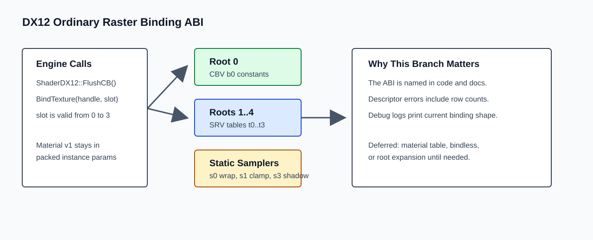

# Roadmap Item Report: dx12-descriptor-upload-root-signature

## What Changed, In Plain English

This branch names the DX12 renderer’s current binding contract instead of leaving it as scattered numbers in the backend. Constants still bind at `b0`, textures still bind through `t0..t3`, and the root signature did not grow. That gives the next material/render work a clear boundary: current material data remains packed into instance data, and a future material table/root-signature expansion should happen only when a real feature needs it.



Descriptor failures also became more useful. If static or transient descriptor rows run out, the exception now reports the used count, capacity, frame, or requested range instead of a generic failure.

## At A Glance

- Source plan: `Agentic/Plans/dx12-descriptor-upload-root-signature-plan.md`
- Archived plan: not archived; root expansion/material table work remains deferred
- Branch: `codex/dx12-descriptor-upload-root-signature`
- Parent branch: `codex/shader-architecture-cleanup`
- Implementation commit: `07f5d0b7db50c987d53f33dd83086c613ca5c365`
- Queue/status commit: `a377faf9837bc91200422d4ffbfa441a97765573`
- Report commit: this commit
- Report web URL: `https://github.com/skullbonez/SkullbonezCore/blob/codex/dx12-descriptor-upload-root-signature/Agentic/Reports/2026-06-15/dx12-descriptor-upload-root-signature/report.md`
- PR: `https://github.com/skullbonez/SkullbonezCore/pull/70`
- Merge SHA: none
- Final status: `pr-open`
- Queue status: `pr-open`
- Started: `2026-06-15T21:52:01+10:00`
- Finished: `2026-06-15T22:07:22+10:00`
- Elapsed: about 15m 21s

## Progress Timeline

- Created `codex/dx12-descriptor-upload-root-signature` from the shader cleanup branch tip.
- Spawned one worker agent for the DX12 binding item.
- Reviewed the worker patch for root-signature compatibility and allocator behavior.
- Marked the queue item running.
- Ran the required DX12 renderer gate.
- Pushed implementation commit `07f5d0b7`.
- Opened draft PR #70 against `codex/shader-architecture-cleanup`.
- Pushed queue/status commit `a377faf`.
- Added this report-only commit.

## Timings

- Worker self-reported total elapsed time: about 8m 20s.
- Worker direct Profile build: 19530 ms, passed.
- First `tools\validate_dx12_renderer.bat`: stopped on formatting for `SkullbonezRenderBackendDX12.h`.
- `tools\format_fix.bat`: about 3s.
- Final `tools\validate_dx12_renderer.bat`: 44376 ms, passed.

## Implementation

`RenderBackendDX12` now has explicit constants for the ordinary raster binding ABI:

- `ROOT_PARAMETER_FRAME_CONSTANTS = 0`
- `ROOT_PARAMETER_FIRST_TEXTURE = 1`
- `SHADER_REGISTER_FRAME_CONSTANTS = 0`
- `SHADER_REGISTER_FIRST_TEXTURE = 0`
- `TEXTURE_SLOT_COUNT = 4`
- `ORDINARY_RASTER_ROOT_PARAMETER_COUNT = 5`

The root signature and draw preparation now use those names instead of numeric `0` and `1 + slot` assumptions. Debug builds log `dx12_ordinary_raster_binding_abi` when the main root signature is created, and architecture stats include the root parameter count plus `t0..t3` slot span.

`Dx12DescriptorAllocator` now validates init geometry, shader-visible descriptor handle indices, and staging descriptor handle indices. Exhaustion messages now include used/capacity information.

`Agentic/Reference/dx12-binding-abi.md` records the current binding contract and deferred expansion gates.

## Changed Files

- `SkullbonezSource/SkullbonezRenderBackendDX12.h`
- `SkullbonezSource/SkullbonezRenderBackendDX12.cpp`
- `SkullbonezSource/SkullbonezRenderBackendDX12.Pipeline.cpp`
- `SkullbonezSource/SkullbonezRenderBackendDX12.Textures.cpp`
- `SkullbonezSource/SkullbonezRenderDeviceDX12.h`
- `SkullbonezSource/SkullbonezRenderDeviceDX12.cpp`
- `SkullbonezSource/SkullbonezShaderContracts.h`
- `Agentic/Reference/dx12-binding-abi.md`
- `Agentic/Reference/shader-inventory.md`
- `Agentic/Reference/render-backend-portability-contract.md`
- `Agentic/Plans/dx12-descriptor-upload-root-signature-plan.md`
- `Agentic/Orchestrator/queue.json`
- `Agentic/SessionState.md`

## Validation

- Required gate: `tools\validate_dx12_renderer.bat`

Commands run:

```text
tools\format_fix.bat
tools\validate_dx12_renderer.bat
```

Result:

```text
tools\validate_dx12_renderer.bat: PASS
Profile build: PASS
Debug build: PASS
DX12 validation errors: 0
water_ball_test: avg_diff=0.0000 max_diff=0 pixels_over_10=0 [PASS]
solver_smoke: avg_diff=0.0002 max_diff=162 pixels_over_10=2 [PASS]
VALIDATE_DX12_RENDERER: ALL PASSED
```

Validation artifacts:

```text
Agentic/Runs/2026-06-15/dx12-descriptor-upload-root-signature/validation.log
TestOutput/validation/dx12_renderer/20260615T120517Z/manifest.json
TestOutput/validation/dx12_renderer/20260615T120517Z/summary.json
```

## Screenshots And Artifacts

DX12 comparison artifacts were generated under:

```text
TestOutput/validation/dx12_renderer/20260615T120517Z/
```

Useful generated files include:

```text
TestOutput/validation/dx12_renderer/20260615T120517Z/water_ball_test_dx12_baseline_vs_current.png
TestOutput/validation/dx12_renderer/20260615T120517Z/water_ball_test_dx12_diff.png
TestOutput/validation/dx12_renderer/20260615T120517Z/solver_smoke_dx12_baseline_vs_current.png
TestOutput/validation/dx12_renderer/20260615T120517Z/solver_smoke_dx12_diff.png
```

## Interesting Code Snippets

Named ABI constants:

```cpp
static constexpr UINT ROOT_PARAMETER_FRAME_CONSTANTS = 0; // CBV b0
static constexpr UINT ROOT_PARAMETER_FIRST_TEXTURE = 1;   // t0 descriptor table
static constexpr int TEXTURE_SLOT_COUNT = 4;              // SRV slots t0..t3
```

Descriptor capacity error shape:

```cpp
msg << "DX12 transient SRV heap exhausted for current frame allocator"
    << " (frame=" << m_currentFrame
    << " used=" << m_nextTransientInFrame
    << " capacity_per_frame=" << m_transientCapacityPerFrame
    << ")";
```

## PR Status

Draft PR #70 is open:

```text
https://github.com/skullbonez/SkullbonezCore/pull/70
```

It is stacked on draft PR #69 by targeting `codex/shader-architecture-cleanup`.

## Merge Status

Not merged. Merge automation is disallowed by orchestrator policy and was not requested.

## Conflicts

No merge conflicts were encountered.

The first DX12 renderer gate stopped on formatting for `SkullbonezRenderBackendDX12.h`. `tools\format_fix.bat` was run, then the full DX12 renderer gate passed.

## Residual Risk

- Root signature expansion remains deferred.
- Material texture/table work remains deferred.
- The current ABI still exposes fixed SRV slots `t0..t3`; a future material table or larger post stack may need a single descriptor table or expanded slots.
- Descriptor lifetime is still managed by the existing allocator model; broad render graph/resource-barrier ownership remains future work.

## Sub-Agent Result Summary

Worker `019ecb21-37c0-72c0-a165-fc5a8dc124e7` implemented the item-2 patch and reported:

- current DX12 ordinary raster binding contract made explicit;
- descriptor capacity diagnostics improved;
- `BindTexture(handle, slot)` compatibility kept;
- no root-signature expansion;
- direct Profile build passed;
- orchestrator still needed the central DX12 renderer gate, which passed.

## Next Queue Action

Start `dx12-only-engine-architecture-cleanup` on the stacked child branch:

```text
codex/dx12-only-engine-architecture-cleanup
```

Base it on:

```text
codex/dx12-descriptor-upload-root-signature
```
