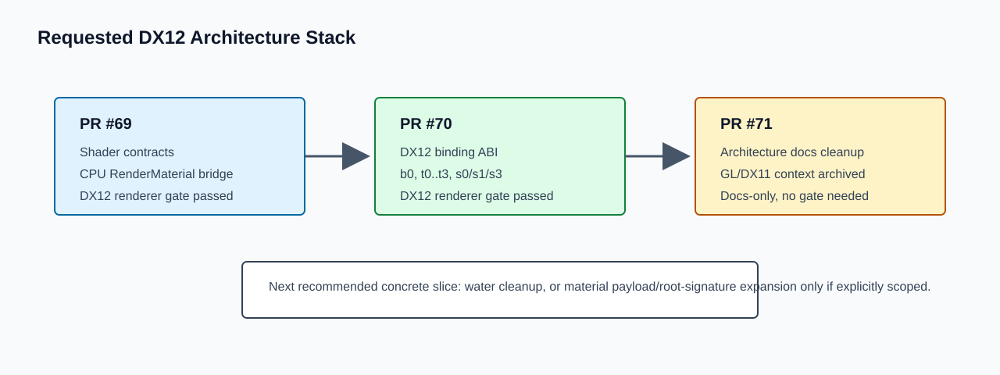

# Roadmap Item Report: dx12-only-engine-architecture-cleanup

## What Changed, In Plain English

This branch tidies the architecture handoff after the two active render cleanup branches. The older DX12-only architecture plan and report now read as historical umbrella direction instead of a fresh instruction to redo shader contracts, root signatures, or GL/DX11 parity work.



The docs now point to the actual stack state: PR #69 adds shader contracts and the CPU `RenderMaterial` bridge; PR #70 names the current DX12 binding ABI; PR #71 reconciles the umbrella architecture docs with that work.

## At A Glance

- Source plan: `Agentic/Plans/Done/dx12-only-engine-architecture-plan.md`
- Archived plan: already archived before this cleanup
- Branch: `codex/dx12-only-engine-architecture-cleanup`
- Parent branch: `codex/dx12-descriptor-upload-root-signature`
- Implementation commit: `9dfa2e8dd4c4f94c07b6c5bdaa09122f17be03e6`
- Queue/status commit: `f0aba74dfec4a40a392a0187dd46c53d58d7ebfe`
- Report commit: this commit
- Report web URL: `https://github.com/skullbonez/SkullbonezCore/blob/codex/dx12-only-engine-architecture-cleanup/Agentic/Reports/2026-06-15/dx12-only-engine-architecture-cleanup/report.md`
- PR: `https://github.com/skullbonez/SkullbonezCore/pull/71`
- Merge SHA: none
- Final status: `pr-open`
- Queue status: `pr-open`
- Started: `2026-06-15T22:08:29+10:00`
- Finished: `2026-06-15T22:16:09+10:00`
- Elapsed: about 7m 40s

## Progress Timeline

- Created `codex/dx12-only-engine-architecture-cleanup` from the item-2 branch tip.
- Spawned one worker agent for the docs-only architecture cleanup item.
- Reviewed the five-file worker patch.
- Marked the queue item running.
- Confirmed the patch is documentation-only and `git diff --check` passed.
- Pushed implementation commit `9dfa2e8`.
- Opened draft PR #71 against `codex/dx12-descriptor-upload-root-signature`.
- Pushed queue/status commit `f0aba74`.
- Added this report-only commit.

## Timings

- Worker elapsed time: about 3m 44s.
- Orchestrator review/commit/PR/report prep: about 4m.
- No build, validation, game launch, or SkullScope run was needed.

## Implementation

The completed DX12-only architecture plan now has a reconciliation section explaining that it is umbrella direction, not a fresh work queue. It records that the current stack has already added DX12-only retirement, shader contract diagnostics, a CPU `RenderMaterial` bridge, and the documented ordinary raster ABI.

The historical architecture report now labels GL/DX11 parity references as historical evidence from that branch. Current renderer PR gates are described as DX12-only validation through `tools\validate_dx12_renderer.bat`.

`Agentic/PlanOrder.md` now points to the next concrete render slice after this stack, with water cleanup called out as the likely next item and material/root-signature expansion deferred unless explicitly scoped.

## Changed Files

- `Agentic/Plans/Done/dx12-only-engine-architecture-plan.md`
- `Agentic/Reports/2026-06-14/dx12-only-engine-architecture/report.md`
- `Agentic/PlanOrder.md`
- `Agentic/SessionState.md`
- `Agentic/Reference/dx12-binding-abi.md`
- `Agentic/Orchestrator/queue.json`

## Validation

- Required gate: none, documentation-only
- Commands run:

```text
git diff --check
```

- Result:

```text
git diff --check: PASS
No repository validation script required.
```

## Screenshots And Artifacts

No runtime screenshots or validation artifacts were produced. This report includes one committed SVG stack diagram:

```text
Agentic/Reports/2026-06-15/dx12-only-engine-architecture-cleanup/images/architecture-stack.svg
```

## Interesting Code Snippets

No code changed. The key handoff wording is in the completed plan:

```text
Read this plan as the umbrella direction, not as a fresh implementation request.
```

And in the plan order:

```text
After that stack is ready, the next concrete render slice should usually come
from `water-rendering-cleanup-plan.md`.
```

## PR Status

Draft PR #71 is open:

```text
https://github.com/skullbonez/SkullbonezCore/pull/71
```

It is stacked on draft PR #70 by targeting `codex/dx12-descriptor-upload-root-signature`.

## Merge Status

Not merged. Merge automation is disallowed by orchestrator policy and was not requested.

## Conflicts

No merge conflicts were encountered.

## Residual Risk

- This branch intentionally does not implement render graph, material table, descriptor indexing, water rendering, or root-signature expansion work.
- The next implementation branch should pick one concrete plan rather than reopening the broad DX12-only umbrella plan.
- If a future branch adds code on top of this docs-only cleanup, it must choose the relevant validation gate then.

## Sub-Agent Result Summary

Worker `019ecb2f-f0a4-7953-ada7-a3a43a8c63b3` completed the docs-only cleanup and reported:

- reconciled the done DX12-only plan/report with current stack outcomes;
- updated plan order and session handoff;
- produced no screenshots or runtime artifacts;
- ran `git diff --check`, which passed;
- no validation script was needed.

## Next Queue Action

The requested three-item stack is represented by draft PRs:

```text
#69 shader architecture cleanup
#70 DX12 descriptor/upload/root-signature cleanup
#71 DX12-only architecture cleanup
```

Recommended next concrete work after review is:

```text
water-rendering-cleanup-plan.md
```

Use `material-system-v1-implementation-plan.md` only if material payload/root-signature expansion is explicitly requested.
