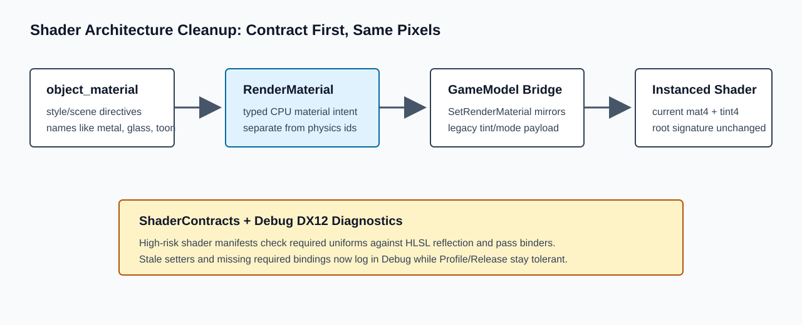

# Roadmap Item Report: shader-architecture-cleanup

## What Changed, In Plain English

This branch made the renderer less dependent on hidden agreement between scene files, C++ setters, and HLSL shader code. Object material choices from style files now become typed render-material data first, then flow through the existing tint/mode bridge so current visuals stay unchanged.



The important shader families now also have runtime-facing contracts. In Debug builds, DX12 shader creation and draw-time constant uploads can report stale uniform names, missing required uniforms, and reflection drift. Profile and Release still use the same tolerant behavior as before, which keeps existing scenes rendering while giving future shader/material work a better warning system.

## At A Glance

- Source plan: `Agentic/Plans/shader-architecture-cleanup-plan.md`
- Archived plan: not archived; the plan is partially implemented and still tracks deferred material-payload/root-signature work
- Branch: `codex/shader-architecture-cleanup`
- Implementation commit: `6cc1baea1a5985eac2b3232f22460f722747607a`
- Queue/status commit: `ea1d42b42bdd4ddb82578162cf772282cdd37332`
- Report commit: this commit
- Report web URL: `https://github.com/skullbonez/SkullbonezCore/blob/codex/shader-architecture-cleanup/Agentic/Reports/2026-06-15/shader-architecture-cleanup/report.md`
- PR: `https://github.com/skullbonez/SkullbonezCore/pull/69`
- Merge SHA: none
- Final status: `pr-open`
- Queue status: `pr-open`
- Started: `2026-06-15T21:15:21+10:00`
- Finished: `2026-06-15T21:50:43+10:00`
- Elapsed: about 35m 22s

## Progress Timeline

- Created `codex/shader-architecture-cleanup` from `origin/main`.
- Spawned one worker agent for the shader architecture cleanup item.
- Reviewed and integrated the worker patch.
- Added Visual Studio project/filter entries for the new shader/material headers.
- Fixed a Debug `/W4` warning-as-error issue in the shader contract tracking vectors.
- Ran shader and DX12 renderer validation.
- Pushed implementation commit `6cc1bae`.
- Opened draft PR #69.
- Pushed queue/status commit `ea1d42b`.
- Added this report-only commit.

## Timings

- Worker handoff: completed within the item run; worker self-reported about 1h 10m in its forked context.
- Initial `tools\validate_shaders.bat`: failed Debug build; log reported `Time Elapsed 00:00:39.43`.
- `tools\format_fix.bat`: about 3s; formatted the new material header.
- `tools\validate_shaders.bat` after fix: 6149 ms, passed.
- `tools\validate_dx12_renderer.bat`: 63431 ms, passed.

## Implementation

`SkullbonezRenderMaterial.h` adds a backend-neutral `RenderMaterialKind` and `RenderMaterial` CPU model. `GameModel` now stores render material intent separately from physics/contact material ids, while `SetRenderTint` remains the compatibility path. Existing `object_material` directives build `RenderMaterial` values and apply them through `SetRenderMaterial`, which still mirrors into the legacy `mat4 + tint4` instance payload.

`SkullbonezShaderContracts.h` defines high-risk shader contracts for object, terrain, water, sky, and post passes. `ShaderDX12` looks up those contracts during compile, checks required uniforms against reflected HLSL names, and in Debug logs bounded diagnostics for stale setters, texture-resource setters still using the uniform API, required uniforms not reflected, and required uniforms not set before cbuffer upload.

Pass binding was centralized without changing frame order: primitive object batches use a shared binder, and sky, volumetric-light, and tonemap passes now bind their shader constants through local helper functions.

No DX12 root-signature, descriptor allocator, upload allocator, HLSL shader, or instance payload expansion was included in this item.

## Changed Files

- `SkullbonezSource/SkullbonezRenderMaterial.h`
- `SkullbonezSource/SkullbonezShaderContracts.h`
- `SkullbonezSource/SkullbonezShaderDX12.cpp`
- `SkullbonezSource/SkullbonezShaderDX12.h`
- `SkullbonezSource/SkullbonezGameModel.cpp`
- `SkullbonezSource/SkullbonezGameModel.h`
- `SkullbonezSource/SkullbonezHelper.cpp`
- `SkullbonezSource/SkullbonezHelper.h`
- `SkullbonezSource/SkullbonezRunPasses.cpp`
- `SkullbonezSource/SkullbonezRunScene.cpp`
- `SkullbonezSource/SkullbonezTerrain.cpp`
- `SkullbonezSource/SkullbonezTestScene.h`
- `SkullbonezSource/SkullbonezTestSceneParser.cpp`
- `SKULLBONEZ_CORE.vcxproj`
- `SKULLBONEZ_CORE.vcxproj.filters`
- `Agentic/Reference/shader-inventory.md`
- `Agentic/Plans/shader-architecture-cleanup-plan.md`
- `Agentic/Orchestrator/queue.json`
- `Agentic/SessionState.md`

## Validation

- Required gate: `tools\validate_dx12_renderer.bat`
- Additional helper: `tools\validate_shaders.bat`

Commands run:

```text
tools\validate_shaders.bat
tools\format_fix.bat
tools\validate_shaders.bat
tools\validate_dx12_renderer.bat
```

Result:

```text
tools\validate_shaders.bat: PASS after uint8_t warning fix
tools\validate_dx12_renderer.bat: PASS
Profile build: PASS
Debug build: PASS
DX12 validation errors: 0
water_ball_test: avg_diff=0.0000 max_diff=0 pixels_over_10=0 [PASS]
solver_smoke: avg_diff=0.0002 max_diff=175 pixels_over_10=2 [PASS]
VALIDATE_DX12_RENDERER: ALL PASSED
```

Validation artifacts:

```text
Agentic/Runs/2026-06-15/shader-architecture-cleanup/validate_shaders.log
Agentic/Runs/2026-06-15/shader-architecture-cleanup/validate_shaders_after_fix.log
Agentic/Runs/2026-06-15/shader-architecture-cleanup/validation.log
TestOutput/validation/dx12_renderer/20260615T114653Z/manifest.json
TestOutput/validation/dx12_renderer/20260615T114653Z/summary.json
```

## Screenshots And Artifacts

DX12 comparison artifacts were generated under:

```text
TestOutput/validation/dx12_renderer/20260615T114653Z/
```

Useful report-adjacent artifacts:

```text
TestOutput/validation/dx12_renderer/20260615T114653Z/water_ball_test_dx12_baseline_vs_current.png
TestOutput/validation/dx12_renderer/20260615T114653Z/water_ball_test_dx12_diff.png
TestOutput/validation/dx12_renderer/20260615T114653Z/solver_smoke_dx12_baseline_vs_current.png
TestOutput/validation/dx12_renderer/20260615T114653Z/solver_smoke_dx12_diff.png
```

## Interesting Code Snippets

CPU material bridge:

```cpp
void GameModel::SetRenderMaterial( const Rendering::RenderMaterial& material )
{
    m_renderMaterial = material;
    m_renderTintR = material.baseColor[0];
    m_renderTintG = material.baseColor[1];
    m_renderTintB = material.baseColor[2];
    m_renderColorOverride = Rendering::RenderMaterialLegacyInstanceMode( material );
}
```

Debug contract check before upload:

```cpp
D3D12_GPU_VIRTUAL_ADDRESS ShaderDX12::FlushCB() const
{
#ifdef _DEBUG
    ReportMissingRequiredContractUniforms();
#endif
```

## PR Status

Draft PR #69 is open:

```text
https://github.com/skullbonez/SkullbonezCore/pull/69
```

## Merge Status

Not merged. Merge automation is disallowed by orchestrator policy and was not requested.

## Conflicts

No merge conflicts were encountered.

The first shader helper run exposed Debug C4244 failures from `std::vector<uint8_t>` fill values in the new diagnostics. That was fixed with explicit `uint8_t` values before the passing validation runs.

The first DX12 renderer gate stopped at formatting for the new headers. `tools\format_fix.bat` was run, with no unrelated formatter churn kept.

## Residual Risk

- The runtime contract table and `tools\shader_contracts.json` are separate sources today; future shader work should update both until a generated/shared source of truth exists.
- Required texture-slot diagnostics are still contract documentation plus old `SetInt` warnings; actual per-draw texture-slot validation remains future work.
- `RenderMaterial` still packs through the old tint/mode bridge. Expanded instance material payloads remain deferred.
- Descriptor/upload/root-signature work remains deferred to the next stacked branch.

## Sub-Agent Result Summary

Worker `019ecb01-9869-7332-8aa6-c97772037823` implemented the first patch and reported:

- Added CPU-side render material contracts.
- Added high-risk shader contract diagnostics.
- Added object/fullscreen pass binder cleanup.
- Updated shader inventory, cleanup plan, and session state.
- Did not commit, push, create a PR, edit run-state files, or run repository validation.

## Next Queue Action

Start `dx12-descriptor-upload-root-signature` on the stacked child branch:

```text
codex/dx12-descriptor-upload-root-signature
```

Base it on:

```text
codex/shader-architecture-cleanup
```
