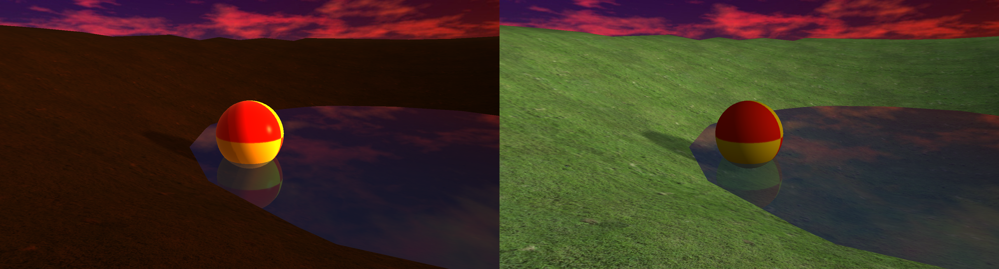
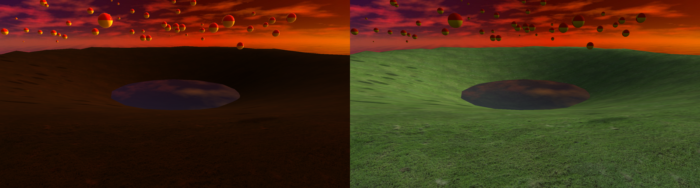
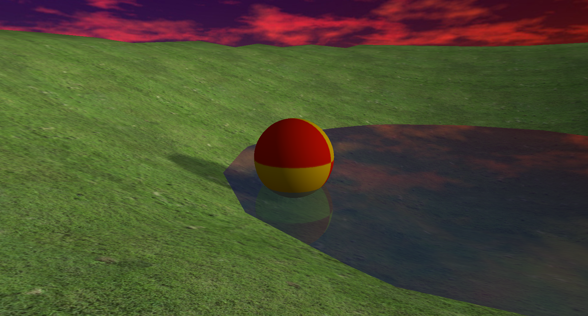
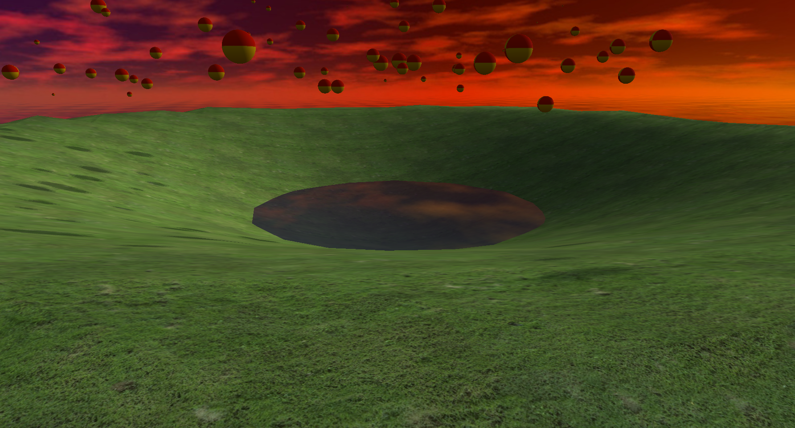

# Roadmap Item Report: non-cinematic-photoreal-lighting

## What Changed, In Plain English

The ordinary, non-cinematic renderer now has its own live Render tab and a real ordinary lighting path. Balls, boxes, terrain, shadows, and water use ordinary sun, sky/ground ambient, material roughness/specular values, and Fresnel water reflection without depending on the cinematic post stack or cinematic shader branches.

This item also closed two verifier-found issues: first, ordinary shadows and ordinary direct lighting now use the same directional sun vector; second, directional light no longer accidentally means cinematic mode.

## At A Glance

- Source plan: `Agentic/Plans/Done/non-cinematic-photoreal-lighting-plan.md`
- Branch: `codex/non-cinematic-photoreal-lighting`
- Final state: `done`
- Started: `2026-06-17T00:22:39+10:00`
- Finished: `2026-06-17T02:29:12+10:00`
- Orchestrator item elapsed: about 2h 6m 33s
- User-requested wall-clock start: `2026-06-17T00:04:11+10:00`
- Wall-clock to lighting completion: about 2h 25m 1s

## Implementation Summary

- Added `OrdinaryRenderConfig` and `ordinary_*` engine.cfg settings for sun color/intensity, sky/ground ambient, shadow tuning, water tint/Fresnel/reflection, and ball/box material tuning.
- Added a `Render` UI tab with live ordinary render controls and command plumbing through `UICommands`, `SkullbonezUI`, `SkullbonezRunUiTextPass`, and `SkullbonezRunInput`.
- Reworked ordinary object shading in `lit_textured_instanced.hlsl` to use roughness/specular/metallic values in a compact BRDF path.
- Reworked ordinary terrain in `lit_textured.hlsl` to use the same sun plus sky/ground ambient vocabulary as objects.
- Split ambient from direct-light visibility so shadows block direct light while ambient and emissive remain readable.
- Added camera-aware Fresnel reflection/tint behavior to ordinary calm and ocean water shaders.
- Documented the current ordinary color path as intentional UNORM output with no additional cinematic tonemap/gamma pass.
- Updated DX12 visual baselines intentionally for `water_ball_test` and `solver_smoke`.

## Verifier Fixes

Round 1 found a real mismatch: ordinary shading still used point-light math while the shadow pass treated the light as directional. The fix changed ordinary frames to directional light (`w = 0`) so shadows and direct light agree.

Round 2 then found the subtle follow-up: shaders were also using `uLightPosition.w == 0` as the cinematic switch, so ordinary directional frames were taking cinematic shader branches. The final fix decouples those meanings:

- `uLightPosition.w` means only light type: directional or point.
- object cinematic mode is encoded separately through signed `uObjectStyle`.
- terrain cinematic mode is encoded separately through `uStyleModes.x`.
- CPU object/terrain routing uses the `CinematicRenderConfig*` pointer, not light `w`, to select cinematic constants.

The pre-refresh image below shows the verifier-driven semantic fix taking effect: the right half is the intended ordinary branch instead of the accidental cinematic branch.



The solver smoke scene shows the same intentional shift into ordinary terrain/material lighting:



## Final Visual Evidence

After refreshing the two expected DX12 baselines, the final renderer gate produced these current captures.





## Validation

Final required gates:

```bat
tools\validate_fast.bat
tools\validate_dx12_renderer.bat
```

Final results:

- `tools\validate_fast.bat`: `VALIDATE_FAST: ALL PASSED`, Profile and Debug builds completed with 0 warnings and 0 errors; elapsed 8.448s.
- `tools\validate_dx12_renderer.bat`: `VALIDATE_DX12_RENDERER: ALL PASSED`, DX12 validation errors 0; elapsed 10.946s.
- Final screenshot comparisons:
  - `water_ball_test`: `avg_diff=0.0000 max_diff=0 pixels_over_10=0`
  - `solver_smoke`: `avg_diff=0.0004 max_diff=6 pixels_over_10=0`

Evidence files:

- `Agentic/Runs/2026-06-17/non-cinematic-photoreal-lighting/validation.log`
- `Agentic/Runs/2026-06-17/non-cinematic-photoreal-lighting/validation-fast-round4.log`
- `Agentic/Runs/2026-06-17/non-cinematic-photoreal-lighting/validation-dx12-renderer-round4.log`
- `Agentic/Runs/2026-06-17/non-cinematic-photoreal-lighting/artifacts/dx12-renderer-summary-final-round4.json`
- `Agentic/Runs/2026-06-17/non-cinematic-photoreal-lighting/artifacts/ordinary-mode-branch-evidence.md`
- `Agentic/Runs/2026-06-17/non-cinematic-photoreal-lighting/artifacts/ordinary-color-management-audit.md`

## Verification Loop

- Round 1 verdict: `needs_fixes`
  - Fixed direct-light versus shadow light-model mismatch.
  - Added screenshot, validation, and plan-status evidence.
- Round 2 verdict: `needs_fixes`
  - Fixed `w == 0` being overloaded as both directional light and cinematic mode.
  - Preserved cinematic low-poly mesh selection while keeping encoded shader mode separate.
- Round 3 verdict: `accepted`
  - No blocking findings.
  - No missing evidence.

## Residual Risk

The ordinary color-space work completed as an audit, not a full sRGB resource migration. The current ordinary path is documented as UNORM output with no known double-gamma or missing-gamma issue. A future color-management task can migrate albedo resources to explicit sRGB formats if desired.

The final report does not include a focused Render-tab screenshot. The verifier accepted source and validation evidence as sufficient; the runtime screenshot evidence focuses on the DX12 validation scenes.

## Next Queue Action

Start the stacked child item `dx12-render-graph-completion` from `codex/non-cinematic-photoreal-lighting`.
