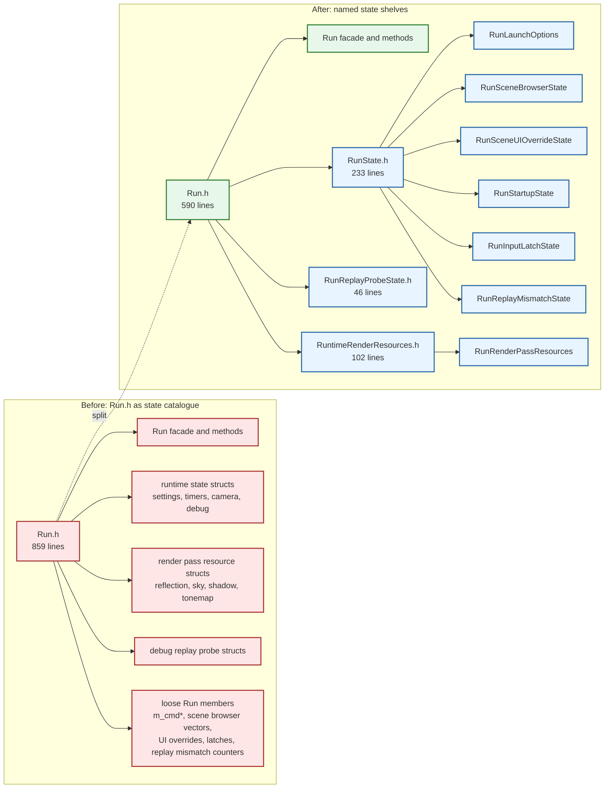
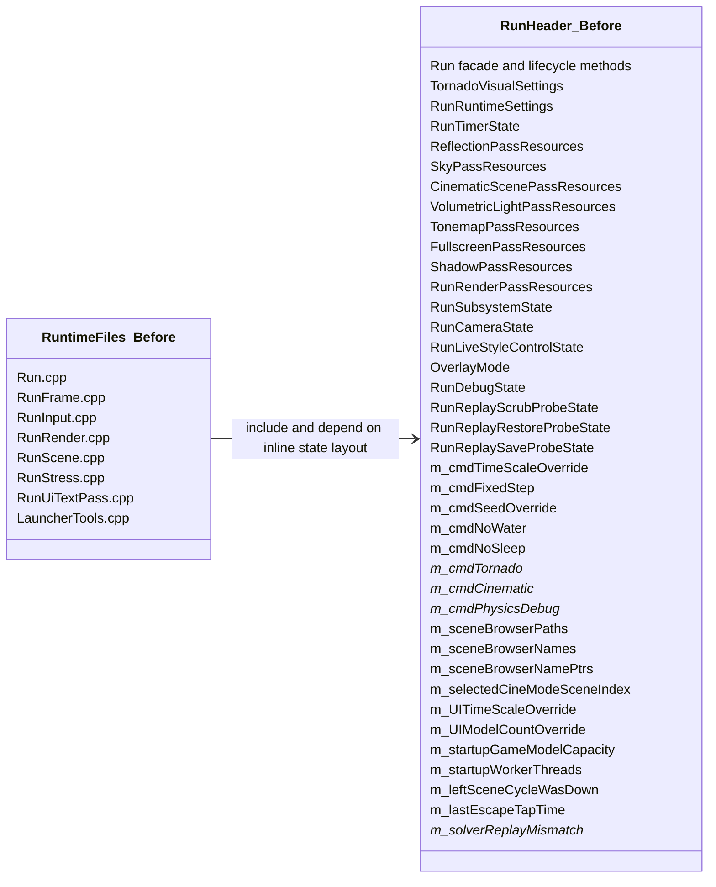
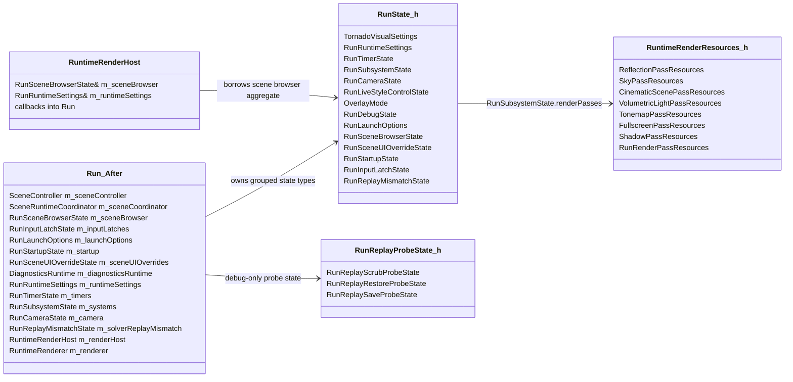
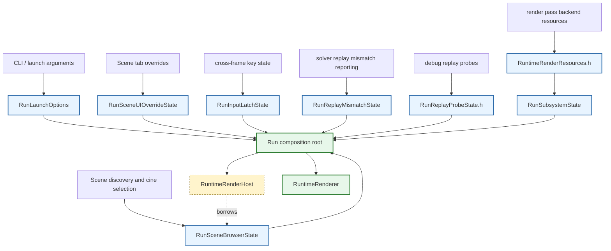
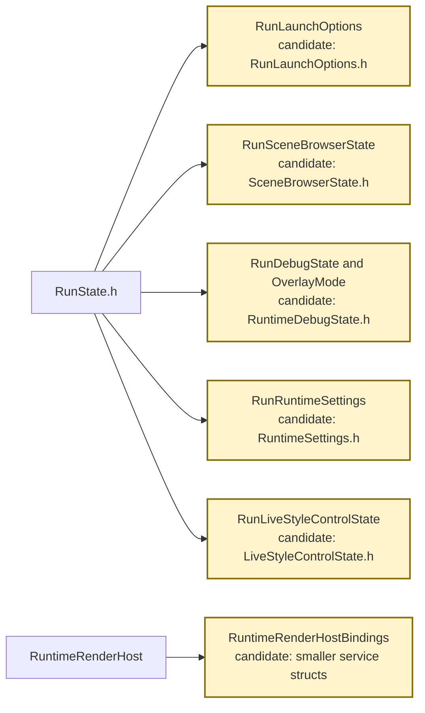

# Run Header State Shelf Before/After Diagrams

Date: 2026-06-25

Comparison points:

- Before: `2fc1cdf87b1c`, the branch state before this follow-up header split.
- After: the working tree prepared for the next commit on `nightrunner-24th-june-refactor`.

This is a narrow follow-up to the larger runtime decomposition. It does not claim
that `Run` stopped being the composition root. The real improvement is that
`Run.h` no longer carries every state aggregate, render-pass resource bundle,
debug replay probe, CLI flag, and scene-browser list inline in the same header.

## One-Screen Delta

## Before Class Shape

The pre-change problem was semantic density. `Run.h` mixed public launch
surface, composition-root ownership, render resource bundles, debug-only replay
probe data, launch policy, UI overrides, input latches, and scene-browser lists.
That made the header hard to scan and made unrelated runtime files appear to
share one flat bag of state.

## After Class Shape

## Architecture Flow

## What Actually Changed

| Area | Before | After |
|------|--------|-------|
| Header shape | `Run.h` contained 859 lines, including the facade, state structs, render resource structs, debug replay probe structs, and many loose state fields. | `Run.h` is 590 lines and delegates state declarations to `RunState.h`, `RunReplayProbeState.h`, and `RuntimeRenderResources.h`. |
| Render resources | Per-pass resource bundles lived in the generic runtime header even though they describe render-owned backend objects. | Render resource bundles live in `Runtime/Render/RuntimeRenderResources.h`; `RunSubsystemState` keeps the single `RunRenderPassResources renderPasses` aggregate. |
| CLI/session flags | Many `m_cmd*` booleans and values were private `Run` fields with shared naming but no aggregate owner. | They are grouped under `RunLaunchOptions m_launchOptions`, so launch policy is one named shelf. |
| Scene browser | Scene browser paths, display names, pointer cache, and selected cine index were separate fields. | They are grouped under `RunSceneBrowserState m_sceneBrowser`; `RuntimeRenderHost` now borrows that aggregate instead of two loose pointers. |
| UI scene overrides | Scene-tab numeric overrides were separate `m_UI*Override` fields. | They are grouped under `RunSceneUIOverrideState m_sceneUIOverrides`. |
| Startup defaults | Startup capacity and worker-thread defaults were loose fields. | They are grouped under `RunStartupState m_startup`. |
| Input latches | Cross-frame scene cycling and escape-tap latch state were loose fields. | They are grouped under `RunInputLatchState m_inputLatches`. |
| Replay mismatch throttling | The report count and suppression flag were loose fields. | They are grouped under `RunReplayMismatchState m_solverReplayMismatch`. |
| Debug replay probes | Debug-only scrub, restore, and save probe structs lived in `Run.h`. | They live in `RunReplayProbeState.h`. |
| Project metadata | New headers were invisible to Visual Studio filters until added. | The `.vcxproj`, `.filters`, and project-filter validator classify the new headers. |

## Honest Remaining Boundaries

- `Run.h` is still a large composition-root header. It now reads more like a
  shell plus member list, but it still owns top-level lifecycle, scene, render,
  UI, tools, diagnostics, physics, replay, and world references.
- `RunState.h` is a staging boundary, not a final home for every state object.
  Some structs can move again when narrower owners appear.
- `RuntimeRenderHost` remains a broad bridge from render code back to runtime
  state. This change narrows one bridge member by borrowing `RunSceneBrowserState`,
  but it does not eliminate the host pattern.
- The refactor is mostly semantic and mechanical. It should reduce friction for
  future extraction work, but it intentionally avoids behavior changes.

## Next Pull-Out Candidates

The next useful split is probably not another blind header shuffle. The best
next step would be to extract one behavior owner with its state, such as scene
browser selection or launch option application, then let the header split follow
that owner.
