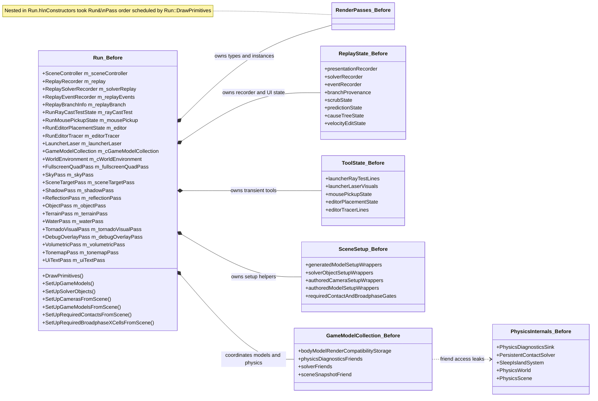
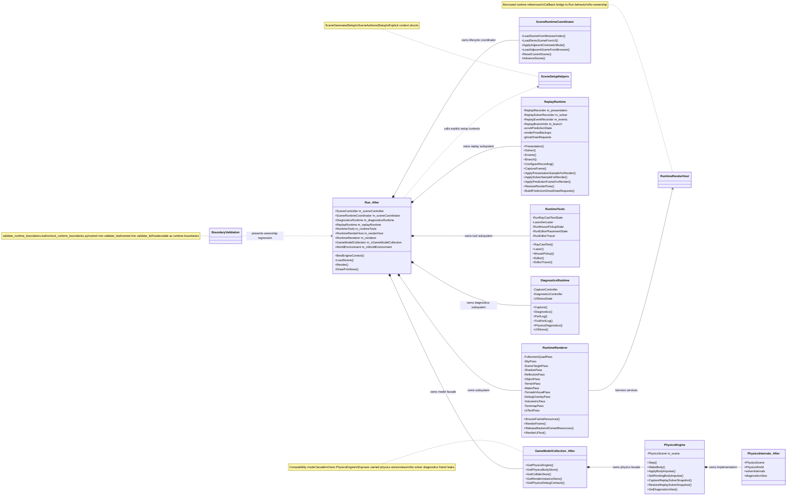
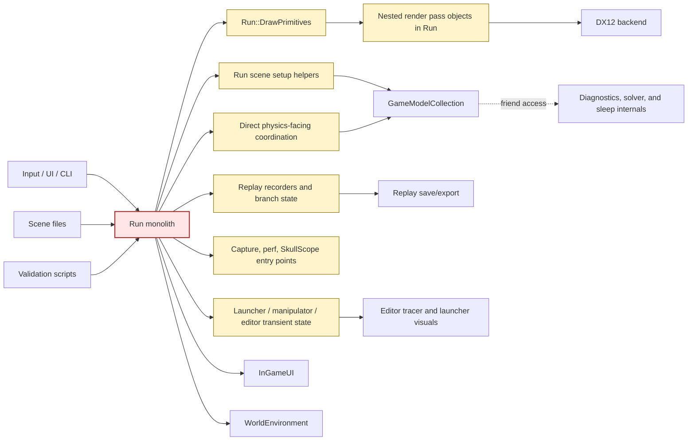
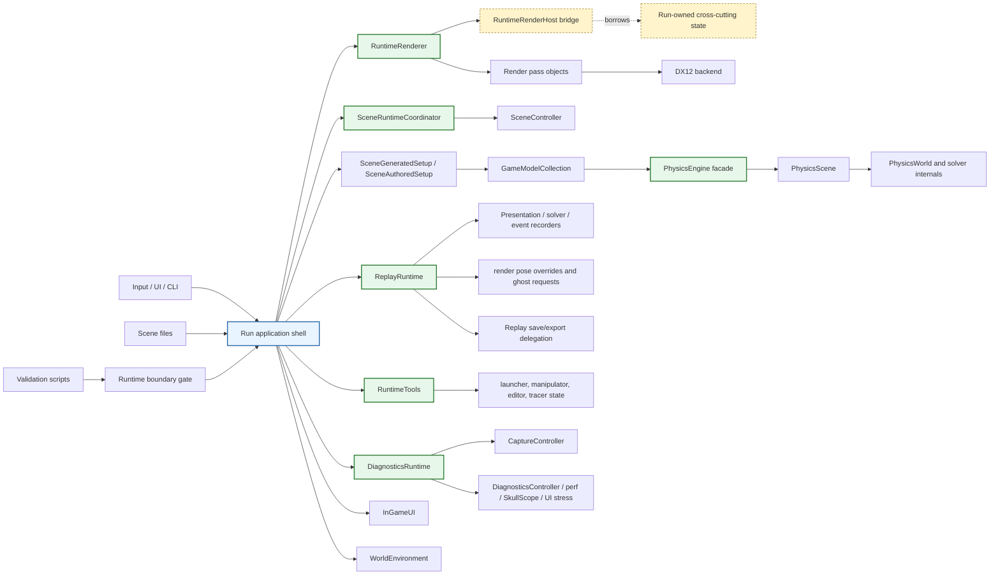
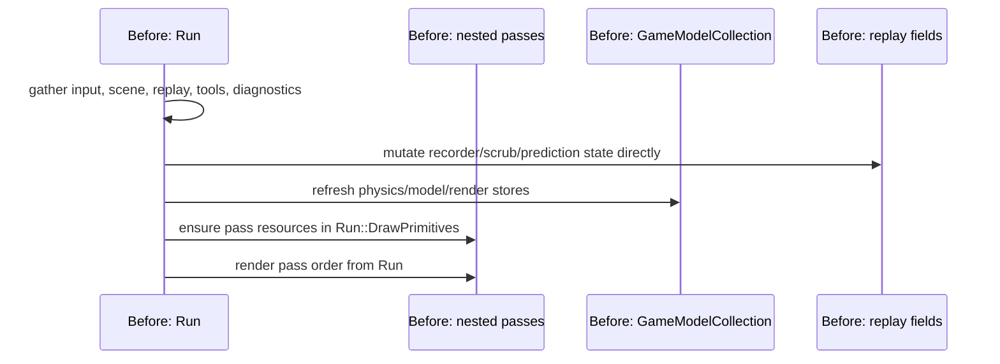
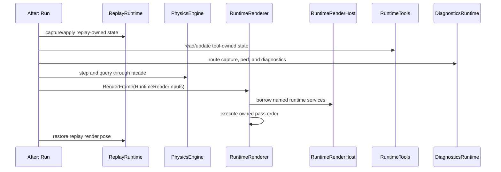
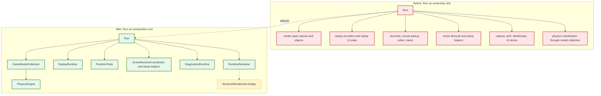

# Runtime Run Decomposition Before/After Diagrams

Date: 2026-06-25

Comparison points:

- Before: `de9940c0402a77291019efd33b657ebe6ea43ef7`, the parent of the first runtime decomposition commit.
- After: `0fba04ffb28c3fd2f1168860dadccbe7ecc3f2c5`, the final Phase 8 boundary-lock commit on `nightrunner-24th-june-refactor`.

This report is intentionally architecture-focused. It shows ownership and control
boundaries that changed, and it calls out remaining compatibility bridges so the
diagrams do not overstate the refactor.

## Executive Delta

Before the refactor, `Run` was the practical owner of most runtime decisions and
state: render pass classes and objects, replay recorders, editor/tool transient
state, scene population helpers, diagnostics entry points, and physics-facing
coordination. Several specialized systems existed, but the runtime still routed
major behavior through `Run` fields and helper methods.

After the refactor, `Run` is much closer to an application shell. It owns top
level subsystem objects and tick order, while ownership of render passes,
replay state, runtime tools, diagnostics state, scene lifecycle decisions, and
physics implementation access moved behind named owners.

The main remaining limitation is not hidden: `Run` still performs broad
composition, still owns some cross-cutting runtime state, and
`RuntimeRenderHost` remains a broad bridge from render passes to runtime state.

## Before Class Ownership

## After Class Ownership

## Before Architecture

The pre-refactor problem was not only file size. The problem was that several
subsystems were not true owners. They were data or helper islands whose state
and scheduling still converged in `Run`.

## After Architecture

The post-refactor architecture has named ownership points. `Run` still composes
the engine, but the major state blocks now have subsystem names that appear in
stack traces, headers, and validation guardrails.

## Control Flow Comparison

## What Actually Improved

| Area | Before | After |
|------|--------|-------|
| Render ownership | `Run.h` declared and stored pass classes; `Run::DrawPrimitives()` scheduled the frame graph. | `RuntimeRenderer` declares the pass owner and owns frame pass order. `Run::DrawPrimitives()` is a compatibility wrapper around `RuntimeRenderer::RenderFrame()`. |
| Render dependencies | Pass constructors took `Run&`, hiding every dependency behind the monolith. | Passes use `RuntimeRenderHost` and `RuntimeRenderInputs`. This names dependencies, though the host is still broad. |
| Scene lifecycle | Scene advance/reset/load decisions and scene setup helpers were concentrated in `Run`. | `SceneRuntimeCoordinator` owns lifecycle decisions; generated/authored setup helpers use explicit context structs. `Run::LoadScene()` still coordinates side effects. |
| Physics boundary | Scene, tools, replay, and diagnostics touched physics through collection-centered compatibility paths and friend readers. | `PhysicsEngine` is the runtime-facing facade over `PhysicsScene`; diagnostics use `PhysicsWorld::DiagnosticsView`; obsolete collection friend leaks were removed. |
| Replay ownership | Presentation/solver/event recorders, branch state, scrub state, prediction state, render-pose backups, and ghost data lived on or around `Run`. | `ReplayRuntime` owns recorders, branch state, replay UI/prediction state, render-pose backup/restore, capture flow, event stamping, export delegation, and ghost draw requests. |
| Runtime tools | Launcher laser, ray-test state, mouse pickup, editor placement, and tracer state lived directly on `Run`. | `RuntimeTools` owns those state blocks and exposes accessors while behavior continues migrating. |
| Diagnostics | Capture, perf, SkullScope, replay probes, and UI stress entry points were reached through `Run` and static helpers. | `DiagnosticsRuntime` owns capture/diagnostics controllers, perf log state, physics diagnostics state, and UI stress state. |
| Regression protection | Nothing automatically stopped `Run.h` from regaining extracted state. | `tools\validate_runtime_boundaries.bat` checks for render pass classes, replay recorder fields, tool transient fields, scene setup helper declarations, and stored `Run` pointers/references in runtime subsystem headers. |

## Honest Remaining Boundaries

- `Run` is still the application composition root. It still owns process
  lifetime, top-level tick order, CLI/UI overrides, scene browser path lists,
  `GameModelCollection`, `WorldEnvironment`, `InGameUI`, and several
  cross-subsystem coordination methods.
- `RuntimeRenderHost` is still intentionally broad. It made render dependencies
  explicit and moved pass ownership out of `Run`, but it still bridges render
  passes back to runtime state and callbacks.
- `GameModelCollection` still owns the `PhysicsEngine` facade and remains a
  compatibility layer over model, body, collider, and render-instance stores.
  The physics implementation is better isolated, not fully independent of the
  collection.
- Some replay and tool behavior still executes in `Run` methods. The important
  change is that large replay/tool state blocks and several replay operations
  now have subsystem owners.
- Scene loading is improved but not fully inverted. `SceneRuntimeCoordinator`
  owns lifecycle decisions and setup helpers are extracted, while
  `Run::LoadScene()` still performs broad side effects across UI, renderer,
  physics, replay, and diagnostics.

## One-Screen Read

