# Parallel validation flowcharts

Every box below is a process boundary. The first line is the test or gate name;
the second line is the launch string. MSBuild, compiler, and operating-system
helper processes started inside a named validation script are intentionally not
expanded.

## Current serial pipeline (measured before the change)

```mermaid
flowchart TD
    A["Plan-completion gate<br/>tools\agent_validate.bat --plan-completion"] --> B["Full validation<br/>tools\validate_full.bat --plan-completion"]
    B --> C["Debug build<br/>tools\validate_build.bat Debug"]
    C --> D["Physics gate<br/>tools\validate_physics.bat"]
    D --> E["Physics lifecycle smoke<br/>Debug\SKULLBONEZ_CORE.exe --physics-standalone-smoke"]
    E --> F0["Physics workers=0 primary<br/>Debug\SKULLBONEZ_CORE.exe --renderer dx12 --vsync off --fixed-step --shadows off --workers 0 --scene SkullbonezData/scenes/physics_bench_varied.scene.json --physics-regression-log Debug/physics_regression_varied.csv"]
    F0 --> F1["Physics workers=0 repeat<br/>Debug\SKULLBONEZ_CORE.exe --renderer dx12 --vsync off --fixed-step --shadows off --workers 0 --scene SkullbonezData/scenes/physics_bench_varied.scene.json --physics-regression-log Debug/physics_regression_varied_workers_0_repeat.csv"]
    F1 --> F2["Physics workers=1<br/>Debug\SKULLBONEZ_CORE.exe --renderer dx12 --vsync off --fixed-step --shadows off --workers 1 --scene SkullbonezData/scenes/physics_bench_varied.scene.json --physics-regression-log Debug/physics_regression_varied_workers_1.csv"]
    F2 --> F4["Physics workers=4<br/>Debug\SKULLBONEZ_CORE.exe --renderer dx12 --vsync off --fixed-step --shadows off --workers 4 --scene SkullbonezData/scenes/physics_bench_varied.scene.json --physics-regression-log Debug/physics_regression_varied_workers_4.csv"]
    F4 --> FC["Physics byte comparator<br/>python tools\check_physics_regression.py --worker-matrix"]
    FC --> G["Automation build<br/>tools\validate_build.bat Automation"]
    G --> H["Fast preflight<br/>tools\validate_fast.bat --preflight-only"]
    H --> H1["Physics golden guard<br/>python tools\check_physics_baseline_guard.py --repo ."]
    H1 --> H2["Plain-language self-test<br/>python tools\check_plain_language.py --repo . --self-test"]
    H2 --> H3["Plain-language scan<br/>python tools\check_plain_language.py --repo ."]
    H3 --> H4["Changed-source format<br/>tools\validate_format.bat"]
    H4 --> H5["Project filters<br/>tools\validate_project_filters.bat"]
    H5 --> H6["Dependency graph<br/>tools\validate_dependency_graph.bat"]
    H6 --> H7["Retained-policy self-tests<br/>powershell -File tools\run_retained_policy_group.ps1 -Mode SelfTest -Repo ."]
    H7 --> H8["Retained-policy live scans<br/>powershell -File tools\run_retained_policy_group.ps1 -Mode Live -Repo ."]
    H8 --> H9["Staged file sizes<br/>python tools\check_staged_file_sizes.py --repo ."]
    H9 --> H10["Profile build<br/>tools\validate_build.bat Profile"]
    H10 --> I["CPU umbrella<br/>tools\validate_all_cpu_tests.bat"]
    I --> I1["Profile doctest suite<br/>tools\validate_tests.bat"]
    I1 --> I2["Debug coverage<br/>tools\validate_coverage.bat"]
    I2 --> I3["Runtime interaction policy<br/>tools\validate_runtime_interaction_policy.bat"]
    I3 --> I4["Scene parser<br/>tools\validate_scene_parser_tests.bat"]
    I4 --> I5["Renderer-free UI boundary<br/>tools\validate_ui_boundary_tests.bat"]
    I5 --> I6["CPU-only DX12 architecture<br/>tools\validate_dx12_arch_tests.bat"]
    I6 --> J["Automation gate<br/>tools\validate_automation.bat"]
    J --> J1["Profile negative boundary<br/>Profile\SKULLBONEZ_CORE.exe --automation-hidden-window --frames 1 --interaction-script SkullbonezData\interaction\replay_prediction_click.json"]
    J1 --> J2["Automation positive smoke<br/>Automation\SKULLBONEZ_CORE.exe --renderer dx12 --vsync off --shadows off --hide-top-text --automation-hidden-window --scene SkullbonezData\scenes\interaction_replay_prediction_harness.scene.json --interaction-script SkullbonezData\interaction\replay_prediction_development_ui_smoke.json --interaction-report TestOutput\validation\automation\replay_prediction_precommit.json --frames 150 --replay on --replay-seconds 2 --fixed-step"]
    J2 --> K["DX12 renderer gate<br/>tools\validate_dx12_renderer.bat"]
    K --> K1["DX12 render suite<br/>Profile\SKULLBONEZ_CORE.exe --renderer dx12 --vsync off --suite SkullbonezData/scenes/render_tests.suite.json"]
    K1 --> P["Exclusive replay frame-spike diagnostic<br/>tools\validate_replay_prediction_frame_spikes.bat"]

    subgraph CI0["Current hosted CI"]
      CA["Single CPU runner preflight<br/>tools\validate_fast.bat --preflight-only"] --> CB["Single CPU runner umbrella<br/>tools\validate_all_cpu_tests.bat"]
      PA["Shared Debug artifact<br/>tools\validate_build.bat Debug"] --> PR1["Physics replica 1 smoke then scene<br/>Debug\SKULLBONEZ_CORE.exe --physics-standalone-smoke; Debug\SKULLBONEZ_CORE.exe --renderer dx12 --vsync off --fixed-step --shadows off --scene SkullbonezData/scenes/physics_bench_varied.scene.json --physics-regression-log Debug/physics_regression_varied.csv"]
      PA --> PR2["Physics replica 2 smoke then scene<br/>Debug\SKULLBONEZ_CORE.exe --physics-standalone-smoke; Debug\SKULLBONEZ_CORE.exe --renderer dx12 --vsync off --fixed-step --shadows off --scene SkullbonezData/scenes/physics_bench_varied.scene.json --physics-regression-log Debug/physics_regression_varied.csv"]
    end
```

## Parallel proposal (implemented)

```mermaid
flowchart TD
    A["Plan-completion gate<br/>tools\agent_validate.bat --plan-completion"] --> B["Full validation<br/>tools\validate_full.bat --plan-completion"]
    B --> C["Debug build<br/>tools\validate_build.bat Debug"]
    C --> D["Physics lifecycle smoke<br/>Debug\SKULLBONEZ_CORE.exe --physics-standalone-smoke"]
    D --> PF{{"Physics process fan-out<br/>python tools\run_parallel_validation.py --manifest tools\validation_parallel_physics.json --repo ."}}
    PF --> F0["Physics workers=0 primary<br/>Debug\SKULLBONEZ_CORE.exe --renderer dx12 --vsync off --fixed-step --shadows off --workers 0 --scene SkullbonezData/scenes/physics_bench_varied.scene.json --perf-log WORKDIR/Profile/varied_physics_perf_log.csv --physics-regression-log REPO/Debug/physics_regression_varied.csv"]
    PF --> F1["Physics workers=0 repeat<br/>Debug\SKULLBONEZ_CORE.exe --renderer dx12 --vsync off --fixed-step --shadows off --workers 0 --scene SkullbonezData/scenes/physics_bench_varied.scene.json --perf-log WORKDIR/Profile/varied_physics_perf_log.csv --physics-regression-log REPO/Debug/physics_regression_varied_workers_0_repeat.csv"]
    PF --> F2["Physics workers=1<br/>Debug\SKULLBONEZ_CORE.exe --renderer dx12 --vsync off --fixed-step --shadows off --workers 1 --scene SkullbonezData/scenes/physics_bench_varied.scene.json --perf-log WORKDIR/Profile/varied_physics_perf_log.csv --physics-regression-log REPO/Debug/physics_regression_varied_workers_1.csv"]
    PF --> F4["Physics workers=4<br/>Debug\SKULLBONEZ_CORE.exe --renderer dx12 --vsync off --fixed-step --shadows off --workers 4 --scene SkullbonezData/scenes/physics_bench_varied.scene.json --perf-log WORKDIR/Profile/varied_physics_perf_log.csv --physics-regression-log REPO/Debug/physics_regression_varied_workers_4.csv"]
    F0 --> FC["Physics byte comparator<br/>python tools\check_physics_regression.py --worker-matrix"]
    F1 --> FC
    F2 --> FC
    F4 --> FC
    FC --> G["Automation build<br/>tools\validate_build.bat Automation"]
    G --> HF{{"Fast-check fan-out<br/>python tools\run_parallel_validation.py --manifest tools\validation_parallel_fast.json --repo ."}}
    HF --> H0["Parallel runner controls<br/>python tools\run_parallel_validation.py --self-test"]
    HF --> H1["Physics golden guard<br/>python tools\check_physics_baseline_guard.py --repo ."]
    HF --> H2["Plain-language policy lane<br/>python tools\check_plain_language.py --repo . --self-test; python tools\check_plain_language.py --repo ."]
    HF --> H3["Changed-source format<br/>tools\validate_format.bat"]
    HF --> H4["Project filters<br/>tools\validate_project_filters.bat"]
    HF --> H5["Dependency graph<br/>tools\validate_dependency_graph.bat"]
    HF --> H6["Retained-policy lane<br/>powershell -File tools\run_retained_policy_group.ps1 -Mode SelfTest -Repo .; powershell -File tools\run_retained_policy_group.ps1 -Mode Live -Repo ."]
    HF --> H7["Staged file sizes<br/>tools\validate_staged_file_sizes.bat"]
    H0 --> HB["Profile build<br/>tools\validate_build.bat Profile"]
    H1 --> HB
    H2 --> HB
    H3 --> HB
    H4 --> HB
    H5 --> HB
    H6 --> HB
    H7 --> HB
    HB --> CF{{"CPU test fan-out<br/>python tools\run_parallel_validation.py --manifest tools\validation_parallel_cpu.json --repo ."}}
    CF --> C1["Profile doctest suite<br/>tools\validate_tests.bat"]
    CF --> C2["Debug coverage<br/>tools\validate_coverage.bat"]
    CF --> C3["Runtime interaction policy<br/>tools\validate_runtime_interaction_policy.bat"]
    CF --> C4["Scene parser<br/>tools\validate_scene_parser_tests.bat"]
    CF --> C5["Renderer-free UI boundary<br/>tools\validate_ui_boundary_tests.bat"]
    CF --> C6["CPU-only DX12 architecture<br/>tools\validate_dx12_arch_tests.bat"]
    C1 --> RF{{"Non-performance runtime fan-out<br/>python tools\run_parallel_validation.py --manifest tools\validation_parallel_runtime_gates.json --repo ."}}
    C2 --> RF
    C3 --> RF
    C4 --> RF
    C5 --> RF
    C6 --> RF
    RF --> AG["Automation gate<br/>tools\validate_automation.bat"]
    AG --> AF{{"Automation process fan-out<br/>python tools\run_parallel_validation.py --manifest tools\validation_parallel_automation.json --repo ."}}
    AF --> AN["Profile negative boundary<br/>Profile\SKULLBONEZ_CORE.exe --automation-hidden-window --frames 1 --interaction-script SkullbonezData\interaction\replay_prediction_click.json"]
    AF --> AP["Automation positive smoke<br/>Automation\SKULLBONEZ_CORE.exe --renderer dx12 --vsync off --shadows off --hide-top-text --automation-hidden-window --scene SkullbonezData\scenes\interaction_replay_prediction_harness.scene.json --interaction-script SkullbonezData\interaction\replay_prediction_development_ui_smoke.json --interaction-report REPO/TestOutput/validation/automation/replay_prediction_precommit.json --frames 150 --replay on --replay-seconds 2 --fixed-step"]
    RF --> DX["DX12 renderer gate<br/>tools\validate_dx12_renderer.bat"]
    DX --> DXG["DX12 render suite<br/>Profile\SKULLBONEZ_CORE.exe --renderer dx12 --vsync off --suite SkullbonezData/scenes/render_tests.suite.json"]
    AN --> PJ["Exclusive replay frame-spike diagnostic<br/>tools\validate_replay_prediction_frame_spikes.bat"]
    AP --> PJ
    DXG --> PJ

    subgraph CI1["Proposed hosted CI runner fan-out"]
      CPA["CPU preflight runner<br/>tools\validate_fast.bat --preflight-only"]
      CT1["CPU runner: Profile doctest<br/>tools\validate_tests.bat"]
      CT2["CPU runner: Debug coverage<br/>tools\validate_coverage.bat"]
      CT3["CPU runner: runtime interaction<br/>tools\validate_runtime_interaction_policy.bat"]
      CT4["CPU runner: scene parser<br/>tools\validate_scene_parser_tests.bat"]
      CT5["CPU runner: UI boundary<br/>tools\validate_ui_boundary_tests.bat"]
      CT6["CPU runner: DX12 architecture<br/>tools\validate_dx12_arch_tests.bat"]
      CPA --> CJ["Mandatory CPU fan-in<br/>echo All mandatory CPU runners passed."]
      CT1 --> CJ
      CT2 --> CJ
      CT3 --> CJ
      CT4 --> CJ
      CT5 --> CJ
      CT6 --> CJ
      PBA["Shared Debug artifact runner<br/>tools\validate_build.bat Debug"] --> PS1["Physics runner: replica 1 lifecycle<br/>Debug\SKULLBONEZ_CORE.exe --physics-standalone-smoke"]
      PBA --> PS2["Physics runner: replica 2 lifecycle<br/>Debug\SKULLBONEZ_CORE.exe --physics-standalone-smoke"]
      PBA --> PV1["Physics runner: replica 1 varied scene<br/>Debug\SKULLBONEZ_CORE.exe --renderer dx12 --vsync off --fixed-step --shadows off --scene SkullbonezData/scenes/physics_bench_varied.scene.json --perf-log EVIDENCE/perf.csv --physics-regression-log Debug/physics_regression_varied.csv"]
      PBA --> PV2["Physics runner: replica 2 varied scene<br/>Debug\SKULLBONEZ_CORE.exe --renderer dx12 --vsync off --fixed-step --shadows off --scene SkullbonezData/scenes/physics_bench_varied.scene.json --perf-log EVIDENCE/perf.csv --physics-regression-log Debug/physics_regression_varied.csv"]
    end
```

The replay frame-spike diagnostic and every budgeted performance gate stay
exclusive: no other game process is launched on that machine while a performance
measurement is running.

## Measured wall-clock change

Measurements used the same warm worktree and command order on 2026-08-31. The
terminal rows both stopped at the same inherited DX12 terrain-image comparison,
after every preceding blocking gate had passed.

| Public path | Serial before | Parallel after | Time saved | Faster |
|---|---:|---:|---:|---:|
| `tools\validate_fast.bat` | 90.446 s | 70.527 s | 19.919 s | 22.0% |
| `tools\validate_fast.bat --preflight-only` | 31.136 s | 15.138 s | 15.998 s | 51.4% |
| `tools\validate_all_cpu_tests.bat` | 207.051 s | 125.070 s | 81.981 s | 39.6% |
| `tools\agent_validate.bat --plan-completion` | 444.298 s | 181.802 s | 262.496 s | 59.1% |

The after-run CPU manifest reported 121.076 seconds inside the six-lane fan-out;
the public wrapper's remaining four seconds were its dependency preflight. The
physics worker manifest completed four game processes in 25.802 seconds; their
individual durations were 23.364, 25.146, 25.734, and 25.801 seconds.
