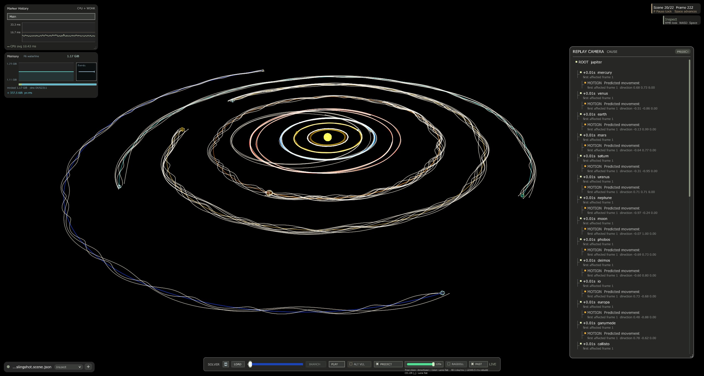
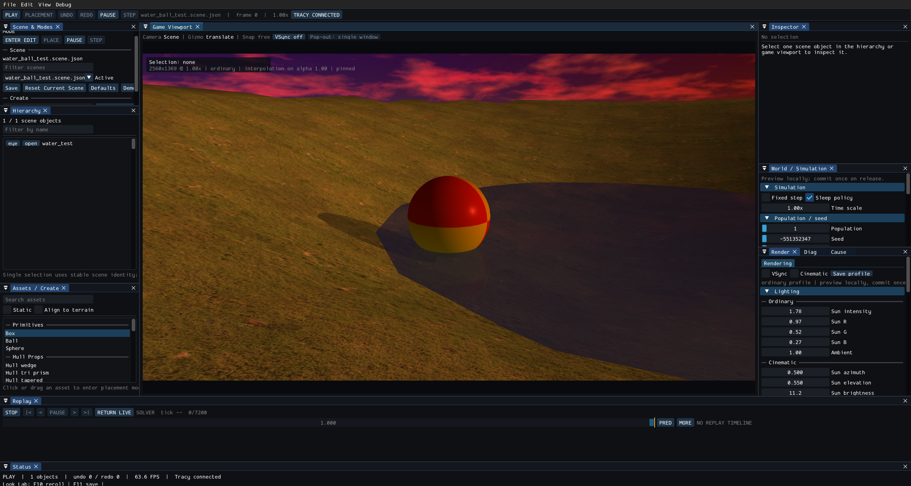
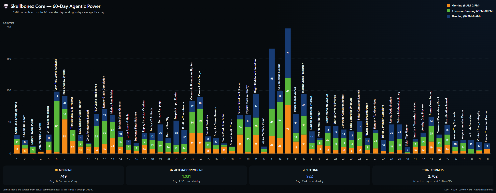

# SkullbonezCore

**A deterministic rigid-body physics engine with an in-development DX12 renderer.**

Windows x64 · C++20 · MSVC v143 · `/W4 /WX`, zero warnings

Originally written in 2005 and rebuilt into a modern, data-oriented, zero-allocation
runtime. This is not a game and it is not trying to become one — it is an engine
core, built to a standard where its physics output is byte-reproducible and every
behavioural claim in the repository has a gate behind it.


*Fully deterministic solar system with all moons with live CPU and memory widgets (top left), causal event chain (right) and replay/prediction controls (bottom).*


*The in-development editor: scene hierarchy, asset placement palette, live world and
lighting inspectors, the replay transport along the bottom, and a connected Tracy
session.*

---

## Physics

The centre of gravity of the project. A persistent-contact sequential-impulse
solver built from the primary literature, not ported from an existing engine.

- **Projected Gauss-Seidel contact solver** — accumulated impulses with per-row
  clamping, Baumgarte stabilisation with bounded bias, and a proper 2D friction
  cone rather than independent per-axis tangent clamps.
- **Persistent contact manifolds** — exact sphere/sphere, closest-point sphere/box,
  SAT plus reference/incident face clipping for box/box, and polygon SAT with
  edge-edge axes for convex hulls.
- **Warm starting on stable contact identity** — manifolds emit deterministic
  feature IDs that survive across frames, so resting contacts resume last frame's
  solution instead of rediscovering support from zero.
- **Deterministic contact reduction** — deepest point first, remaining rows chosen
  to maximise tangent-plane spread, ties broken by feature ID so a clipped polygon
  never collapses into four adjacent solver rows.
- **Resting, support and sleep** — support-footprint classification, island
  propagation through a disjoint set, quiet-frame sleep gating, and explicit wake
  paths for contact, joint, impulse and underwater transitions.
- **Stacking and rest quality** — boxes and hulls settle onto faces, edge-balanced
  bodies are denied sleep support until they topple, and terrain contacts receive a
  gravity-sized support seed so grounded bodies do not sink before convergence.
- **Broadphase** — persistent spatial hash grid with integer cell membership, plus
  a one-step swept overlay so fast projectiles still pair correctly.

Payloads it runs: thousands of interacting rigid bodies (8,192 body ceiling, 4,000
default scene capacity) across spheres, boxes and baked convex hulls — ragdolls
built from point-joint constraints, buoyant bodies in fluid, terrain contact against
analytic and heightfield surfaces, projectile impacts, destructible fixed-body trees,
and n-body mutual gravity with orbital mechanics. The primary regression workload
runs 211 dynamic bodies for 6,800 frames and settles to sleep, byte-identically,
every time.

## Determinism

Byte-exactness is the validation contract, not an aspiration.

- Physics regression output is compared **byte-for-byte** against committed CSV
  baselines. Baselines are owner-controlled; an agent may never refresh one to make
  a diff go away.
- `#pragma fp_contract(off)` is force-included into every translation unit, so the
  compiler cannot fuse a multiply-add and silently change rounding.
- Parallel physics stages are **worker-count invariant** — workers build local
  output only, and the caller thread merges chunks in deterministic order. Tests
  assert identical kinematics and sleep state at 0, 1 and 4 workers.
- Zero runtime allocation by policy. Storage is fixed or reserved before gameplay
  begins; exhaustion is a loud diagnostic with owner, capacity and high-water, never
  a silent grow.
- No exceptions in engine code. Failures go down one of three explicit categories:
  fatal invariant, recoverable result, or probe assertion.

## Deterministic Replay and Prediction

A large subsystem, and deliberately so — it is the feature the rest of the engine is
built to support.

Replay records simulation at frame granularity and reproduces it exactly, which makes
scrubbing, causal analysis, and frame-exact visual fidelity gates possible. Prediction
runs an isolated clone of the physics engine ahead of the live simulation on a worker,
publishing completed prefixes through a release/acquire protocol so readers never
observe a partial future. Together they support trajectory display, intercept
readouts, trip planning, and porkchop-style launch-window analysis.

Its size is proportionate to what it does. Deterministic replay of a full physics
world is not a debug convenience bolted on afterwards; it is load-bearing
infrastructure, and it is why the physics determinism contract above is enforced so
strictly.

## Rendering — in development

DX12 is the only runtime renderer. The architecture is real; the feature set is still
being built out.

- **Render graph** with declared pass access, derived resource barriers, subresource
  state tracking, and transient allocation with lifetime-based pool aliasing. Ordinary
  frame transitions are derived, never hand-written.
- **Fence-proven deferred release** — invalidated resources and descriptors enter a
  bounded quarantine and are freed only once a covering fence proves no GPU reference
  remains.
- **Shader reflection contracts** — CPU-side declarations are validated at startup
  against metadata baked from the compiled DXIL, so a struct that drifts from its
  HLSL counterpart fails loudly instead of rendering garbage.
- 23 HLSL shaders: lit and instanced opaque, shadow depth, atmospheric sky, calm and
  ocean water, volumetric light, tonemapping, text, UI, debug visualisation, and a
  DXR raytraced reflection path with BLAS/TLAS/SBT management.
- Zero DX12 validation errors is a hard gate. Visual regression is screenshot-diffed
  against committed baselines, and every renderer change must survive a bounded
  crash-free graphics stress run.

**ImGui and Tracy integration are a work in progress.** The editor surface and the
profiler instrumentation are partially wired and are being completed incrementally.

## Built for Agentic Development

The guardrails are mechanical rather than documentary — executable gates and tests
carry the contract, not prose.

| | Approximate size |
|---|---|
| Engine source | 230k lines |
| Tests | 30k lines (main suite plus four standalone CPU targets) |
| Governance and reference docs | 7k lines |
| Validation and tooling scripts | 105 |


The engine is developed largely by **an automated nightly agent loop**. Each run reads
`Agentic/Plans/MASTER-PLAN.md` — the authoritative ledger of every live plan and task —
selects the next task in binding order, implements it on a fresh nightly branch,
runs the validation gates mapped to the files it touched, submits the result to an
independent review pass, then commits under the owning plan's task counter. Plans
carry explicit owner rulings, non-goals, acceptance criteria and per-phase evidence,
so the next run starts from a written state rather than an inference. Closure
evidence lives in the commit that carried it; git history is the archive.

That model only works if the guardrails are stronger than usual. Hence: byte-exact
oracles, negative controls that prove a test can actually fail, mechanical dependency
and ownership inventories, a documented comment standard applied to every source file,
and validation gates keyed to the exact files a change touched. The governance is
what makes unattended development safe; `AGENTS.md` is the contract, and it is written
for any agent, not one vendor's.

A few consequences visible in the tree: zero `TODO`/`FIXME`/`HACK` markers in
engine source, zero `throw` statements in engine code, zero raw `new`/`delete`
outside the allocator, and two inheritance relationships in 230k lines — only one
of which uses runtime polymorphism.

## What Is Not Here

Stated plainly, because a README that only lists strengths is not useful:

- **No game.** No gameplay framework, no progression, no content pipeline beyond
  scenes and assets. The engine is the product.
- **No audio, animation, networking, AI or navigation subsystems.** None of these
  exist.
- **The renderer is mid-build.** The architecture is sound and the gates are strict,
  but the shading and material feature set is modest next to a production engine.
- **ImGui and Tracy are partially integrated**, as noted above.
- **Very large stacks are a known limit.** Ordinary stacking, resting and sleep are
  solid; pushing to deep towers is parked pending an evaluation of Bullet-style split
  impulse and Box2D substep/relaxation techniques. It is a recorded decision with a
  parked plan, not an unknown.
- **Windows and MSVC only.** x64, DX12, v143. No portability layer.

---

## Start Here

**Clone.** The full history carries years of build artefacts and image
baselines. Unless you need that history, take the shallow clone — same working
tree, roughly a fifth of the download:

```bat
git clone --depth 1 https://github.com/skullbonez/SkullbonezCore.git
```

**Humans**
1. `FIRST_TIME_SETUP.md` if this is a new machine.
2. Build with `tools\validate_build.bat Profile`.
3. `Agentic/Reference/runtime-reference.md` for command line, scenes, physics settings
   and key bindings.

**Agents**
1. Follow the Agent Startup Contract in `AGENTS.md`.
2. Load only the skill, plan, report or reference file the current task needs.

## Build

```bat
tools\validate_build.bat Debug
tools\validate_build.bat Profile
tools\validate_build.bat Release
```

Outputs to `Debug\`, `Profile\`, `Release\SKULLBONEZ_CORE.exe`.

The renderer-free CPU library and tests also build through CMake for
second-toolchain validation. The library contains complete Maths, Physics, and
UI source sets plus the portable Core, Gameplay, authored-scene, terrain, and
asset-system closure. The test executable reuses every `SkullbonezTests` source
that has no direct Runtime or Rendering include:

```bat
cmake -S . -B build\portable -DCMAKE_BUILD_TYPE=Release
cmake --build build\portable --config Release --target skullbonez_portable_tests
ctest --test-dir build\portable -C Release --output-on-failure
```

## Run

```bat
Profile\SKULLBONEZ_CORE.exe --scene SkullbonezData\scenes\water_ball_test.scene.json --vsync off
Profile\SKULLBONEZ_CORE.exe --suite SkullbonezData\scenes\render_tests.suite.json --vsync off
Profile\SKULLBONEZ_CORE.exe --fixed-step --scene SkullbonezData\scenes\perf_test.scene.json --vsync off
```

## Validate

Validation scripts are pre-commit and PR gates, not routine as-you-go checks. Pick the
smallest script that covers what changed:

| Change | Command |
|---|---|
| Documentation only | none required |
| Small refactor | `tools\validate_fast.bat` |
| Physics, collision, solver, determinism | `tools\validate_physics.bat` |
| Renderer or shaders | `tools\validate_dx12_renderer.bat` + `tools\run_graphics_stress.bat 1` |
| Hot path or allocation | `tools\validate_perf.bat` |
| Broad, or unsure | `tools\validate_fast.bat` plus every affected focused gate |
| Entire implementation plan is complete | `tools\agent_validate.bat --plan-completion` |

The complete file-to-gate mapping is in `AGENTS.md`; per-script detail is in
`tools/README.md`. Physics baseline changes are behaviour changes and require explicit
owner approval before the corresponding gate is rerun.

## Repository Map

| What | Path |
|---|---|
| Solution | `SKULLBONEZ_CORE.sln` |
| Engine source | `SkullbonezSource/` |
| Tests | `SkullbonezTests/`, `Agentic/Tests/` |
| Shaders | `SkullbonezData/shaders/` |
| Scenes and assets | `SkullbonezData/` |
| Baselines | `TestOutput/baselines/` |
| Validation and tooling | `tools/` |
| Agent contract and handoff | `AGENTS.md`, `Agentic/` |

## Further Reading

- `AGENTS.md` — the engineering contract: dependency rules, ownership review model,
  allocation and error-handling policy, validation mapping
- `Agentic/Reference/physics-overview.md` — solver and collision detail
- `Agentic/Reference/engine-glossary.md` — shared vocabulary
- `Agentic/Plans/MASTER-PLAN.md` — live plan ledger
- `THIRD_PARTY_NOTICES.md` — third-party components
